# Modelo ML — Operaciones Aeronauticas Chile (JAC)

> Proyecto de Machine Learning sobre la bitacora de vuelos de Chile (1999–2026).
> Fuentes: [datos.gob.cl — Junta de Aeronautica Civil](https://datos.gob.cl/dataset/operaciones-aeronaves) · [Meteostat — Puerto Montt, estacion 85799](https://meteostat.net/es/place/cl/puerto-montt?s=85799)

---

## Indice

**Definicion del proyecto**

- [¿De que trata este proyecto?](#de-que-trata-este-proyecto)
- [Problema de negocio y objetivos](#problema-de-negocio-y-objetivos)
- [KPIs — como se mide el exito](#kpis--como-se-mide-el-exito)
- [Metodologia — CRISP-DM](#metodologia--crisp-dm)
- [Fuentes de datos y herramientas](#fuentes-de-datos-y-herramientas)

**Desarrollo**

- [Arquitectura y Pipeline](#arquitectura-y-pipeline)
- [Como ejecutar el proyecto](#como-ejecutar-el-proyecto)
- [Preparacion de los datos](#preparacion-de-los-datos)
- [Analisis Exploratorio — Graficos clave](#analisis-exploratorio--graficos-clave)
- [Calidad de los datos — que encontramos al mirar de cerca](#calidad-de-los-datos--que-encontramos-al-mirar-de-cerca)
- [Modelado No Supervisado — Clustering](#modelado-no-supervisado--clustering)
- [Modelado Supervisado — Clasificacion](#modelado-supervisado--clasificacion)

**Prediccion de retrasos (PoC Puerto Montt)**

- [Impacto de Negocio — por que predecir retrasos](#impacto-de-negocio--por-que-predecir-retrasos)
- [Como se construye el retraso si el dato no lo trae](#como-se-construye-el-retraso-si-el-dato-no-lo-trae)
- [El cruce con el clima](#el-cruce-con-el-clima)
- [¿Cuanto retrasa realmente el clima?](#cuanto-retrasa-realmente-el-clima)
- [El Score de Riesgo Operativo](#el-score-de-riesgo-operativo)
- [Aprendizaje no supervisado sobre el problema de retrasos](#aprendizaje-no-supervisado-sobre-el-problema-de-retrasos)
- [Interpretacion del desempeño — que significa cada numero](#interpretacion-del-desempeño--que-significa-cada-numero)
- [Ventana de Confianza — 7 a 14 dias](#ventana-de-confianza--7-a-14-dias)

**Cierre**

- [Etica, sesgos y privacidad](#etica-sesgos-y-privacidad)
- [Conclusiones y Decisiones de Negocio](#conclusiones-y-decisiones-de-negocio)
- [Trabajo futuro](#trabajo-futuro)
- [Estructura del proyecto](#estructura-del-proyecto)
- [Respuesta a la retroalimentacion de la EP1](#respuesta-a-la-retroalimentacion-de-la-ep1)

---

## ¿De que trata este proyecto?

Chile tiene 69 aeropuertos activos y registra mas de **11 millones de operaciones aereas** entre 1999 y 2026. Esta base de datos — publicada abiertamente por la JAC — es una de las series historicas mas completas de transporte aereo en Latinoamerica.

El proyecto tiene **dos lineas de trabajo** que corren en paralelo:

**1. Modelo Base (baseline).** Demuestra que la arquitectura Kedro funciona de punta a punta: clasifica vuelos internacionales vs domesticos y agrupa aeropuertos por comportamiento operativo.

- ¿Como se distribuye el trafico aereo en Chile?
- ¿Se pueden agrupar los aeropuertos por su comportamiento operativo?
- ¿Se puede predecir si un vuelo es internacional solo con sus datos operativos?

**2. Modelo de Riesgo Operativo (`retrasos_ml`).** Ataca una pregunta con impacto economico directo, acotada a Puerto Montt como prueba de concepto:

- **¿Hasta que punto el clima puede retrasar un vuelo?**

La respuesta corta a esa ultima pregunta, adelantada aqui porque es el hallazgo central del proyecto: **mucho menos de lo que se supone**. El detalle esta en [¿Cuanto retrasa realmente el clima?](#cuanto-retrasa-realmente-el-clima).

---

## Problema de negocio y objetivos

### El problema

Un vuelo retrasado cuesta dinero, y cuesta en varios frentes a la vez: combustible quemado en tierra, horas de tripulacion fuera de itinerario, ocupacion de gate que bloquea a otra aeronave, compensaciones a pasajeros y perdida de conexiones. **Ninguno de esos costos aparece en los datos publicos** — pero los minutos si. Por eso el proyecto usa el retraso como **variable proxy del costo operativo**: no tenemos las facturas de la aerolinea, tenemos los minutos, y los minutos se convierten en pesos.

El problema concreto que se ataca: **un jefe de operaciones en El Tepual no sabe, con una o dos semanas de anticipacion, que dias van a ser malos.** Si lo supiera, podria mover tripulacion de reserva, ajustar el buffer entre rotaciones o avisar a los pasajeros antes de que lleguen al aeropuerto.

La hipotesis de partida — la que el equipo quiso poner a prueba — es que **el clima explica buena parte de esos dias malos**. Puerto Montt es un buen lugar para probarla: llueve el 44.9% de los dias.

### Objetivos

**Objetivo general.** Determinar si es posible anticipar el riesgo de retraso de un vuelo en El Tepual cruzando la bitacora operativa de la JAC con datos meteorologicos historicos, y cuantificar cuanto de ese riesgo explica efectivamente el clima.

**Objetivos especificos:**

| # | Objetivo | Estado |
|---|---|---|
| O1 | Construir un pipeline reproducible de ingesta, limpieza e integracion de las tres fuentes | ✅ Cumplido — 22 nodos Kedro, 207 s |
| O2 | Derivar una medida de retraso valida a partir de datos que **no** incluyen hora programada | ✅ Cumplido — horario reconstruido por slots |
| O3 | Cruzar vuelos y clima a nivel diario sin degradar el rendimiento | ✅ Cumplido — 71 606 vuelos, 0 sin clima |
| O4 | Cuantificar el efecto del clima sobre la tasa de retraso | ✅ Cumplido — el efecto es casi nulo salvo viento cruzado extremo |
| O5 | Entregar un Score de Riesgo accionable (0-100%) | ⚠️ **No alcanzado** — lift 1.12, insuficiente para decidir |
| O6 | Documentar sesgos, limites y consideraciones eticas del uso del modelo | ✅ Cumplido — ver [Etica, sesgos y privacidad](#etica-sesgos-y-privacidad) |

> **O5 no se alcanzo y se reporta como tal.** El modelo existe, corre y esta calibrado, pero no discrimina lo suficiente como para sostener una decision operativa. Presentarlo como exitoso seria el error mas grave que este proyecto podria cometer.

---

## KPIs — como se mide el exito

Los KPIs se dividen en dos niveles: los del **negocio** (que mide la aerolinea) y los del **modelo** (que decide si la solucion se despliega o se descarta).

### KPIs de negocio

Medidos sobre los 71 606 vuelos regulares de El Tepual, 2020-2025:

| KPI | Definicion | Valor actual | Meta propuesta |
|---|---|---|---|
| **Tasa de puntualidad** | % de vuelos con desvio ≤ 15 min sobre su horario habitual | **84.8%** | ≥ 88% |
| **Tasa de retraso severo** | % de vuelos con desvio > 60 min | **4.2%** | ≤ 3% |
| **Minutos de retraso acumulados** | Suma mensual de minutos de atraso — el proxy de costo | **≈ 12 500 min/mes** (≈ 208 h) | −15% |
| **Concentracion horaria del retraso** | Diferencia de puntualidad entre la primera y la ultima ola del dia | **7.9 pts** (10.8% → 18.7%) | ≤ 5 pts |

El tercero es el que traduce a dinero: **208 horas de atraso al mes** en un solo aeropuerto. Multiplicado por el costo hora de una aeronave con tripulacion, es la cifra que justifica el proyecto.

### KPIs del modelo — y el umbral de decision

Un modelo predictivo solo se despliega si supera al metodo que ya existe (que hoy es "asumir que todos los vuelos tienen el mismo riesgo"). Los umbrales se fijaron **antes** de ver los resultados en el conjunto de prueba:

| KPI del modelo | Umbral para desplegar | Resultado obtenido | ¿Pasa? |
|---|---|---|---|
| **Lift sobre la tasa base** | ≥ 1.50 | **1.12** | ❌ No |
| **ROC-AUC en datos futuros** | ≥ 0.65 | **0.524** | ❌ No |
| **Brier score (calibracion)** | ≤ 0.13 | **0.119** | ✅ Si |
| **Aporte del clima al AUC** | > 0 | **−0.015** (lo empeora) | ❌ No |

**Tres de los cuatro KPIs no se cumplen, y el proyecto lo declara abiertamente.** El unico que pasa es la calibracion — el modelo es honesto sobre su propia incertidumbre, pero esa incertidumbre es demasiado alta para decidir con ella.

> Definir el umbral **antes** de mirar el test es lo que impide la trampa mas comun en ML aplicado: mover la meta hasta que el modelo la alcance.

---

## Metodologia — CRISP-DM

El proyecto sigue **CRISP-DM** (Cross-Industry Standard Process for Data Mining), y su caracteristica de ciclo — no de linea recta — fue determinante: el proyecto **volvio dos veces a fases anteriores** al descubrir problemas que no eran visibles al principio.

| Fase | Que se hizo aqui | Donde verlo |
|---|---|---|
| **1. Comprension del negocio** | Definicion del retraso como proxy de costo operativo; KPIs con umbral de despliegue fijado por adelantado; ventana de confianza de 7-14 dias | [Problema y objetivos](#problema-de-negocio-y-objetivos) · [KPIs](#kpis--como-se-mide-el-exito) |
| **2. Comprension de los datos** | Perfilado de las 12 columnas de la bitacora, conteo de nulos, cobertura del clima. **Aqui se descubrio que no existe hora programada** | [Preparacion de los datos](#preparacion-de-los-datos) · pipeline `data_inventory` |
| **3. Preparacion de los datos** | Imputacion de PMD, reconstruccion del horario de referencia, viento cruzado, LEFT JOIN por `fecha_cruce` | [Como se construye el retraso](#como-se-construye-el-retraso-si-el-dato-no-lo-trae) · [El cruce con el clima](#el-cruce-con-el-clima) |
| **4. Modelado** | K-Means (k=4), RandomForest, y para retrasos: GradientBoosting regularizado vs Regresion Logistica, sobre tres conjuntos de features | [Clustering](#modelado-no-supervisado--clustering) · [Score de Riesgo](#el-score-de-riesgo-operativo) |
| **5. Evaluacion** | Split temporal de tres tramos, importancia por permutacion, calibracion. **Contraste contra los umbrales definidos en la fase 1** | [El Score de Riesgo Operativo](#el-score-de-riesgo-operativo) |
| **6. Despliegue** | Modelos serializados en `data/06_models/`. **Decision explicita de NO desplegar** el modelo de retrasos | [Conclusiones](#conclusiones-y-decisiones-de-negocio) |

**Los dos ciclos de retroalimentacion que hubo que hacer:**

1. **Fase 2 → Fase 1.** Al perfilar los datos aparecio que la bitacora no trae hora programada. El objetivo original ("restar programada menos real") era irrealizable y hubo que redefinir el target antes de seguir.
2. **Fase 5 → Fase 3.** La primera evaluacion dio AUC 0.84 en entrenamiento y 0.49 en prueba — sobreajuste severo. Eso obligo a volver a la preparacion, detectar que se estaba usando la hora **real** en vez de la **programada**, y rehacer las features.

> Ese segundo ciclo es el mas instructivo del proyecto: **un error de preparacion de datos se disfrazo de buen resultado de modelado.** Solo la evaluacion con split temporal lo dejo al descubierto.

---

## Fuentes de datos y herramientas

### Fuentes de datos

| Fuente | Origen | Volumen | Licencia | Por que se eligio |
|---|---|---|---|---|
| **Bitacora de vuelos** | [datos.gob.cl — JAC](https://datos.gob.cl/dataset/operaciones-aeronaves) (`.parquet`) | 11 074 197 filas × 12 col, 137 MB | Datos abiertos de Gobierno de Chile | Unica serie con el detalle operacion a operacion; incluye la marca de tiempo que permite derivar el retraso |
| **Operaciones por aeropuerto** | [datos.gob.cl — JAC](https://datos.gob.cl/dataset/operaciones-aeronaves) (`.csv`) | Agregado mensual por aeropuerto | Datos abiertos | Aporta `cnt_operaciones`, la medida de congestion mensual que la bitacora no trae |
| **Clima diario** | [Meteostat, estacion 85799](https://meteostat.net/es/place/cl/puerto-montt?s=85799) | 2 192 dias, 11 columnas | Meteostat / fuentes NOAA-DWD | Cobertura completa del periodo sin dias faltantes y con direccion de viento, que es lo que permite calcular el viento cruzado |

Las tres son **publicas y de acceso abierto**; ninguna requiere credenciales ni contiene datos de pasajeros.

### Herramientas y su justificacion

| Herramienta | Para que | Por que esta, y no otra |
|---|---|---|
| **Git + GitHub** | Control de versiones y trabajo en paralelo del equipo | Permite que cada integrante trabaje en una rama sin pisar el trabajo del resto; el historial deja trazable **quien** cambio **que** y **por que** — clave para una defensa individual |
| **Kedro** | Orquestacion del pipeline | Convierte cada transformacion en un nodo con entradas y salidas declaradas. Sin esto, el proyecto seria un notebook de 800 lineas imposible de revisar entre varias personas |
| **Catalogo de datos (`catalog.yml`)** | Registro central de datasets | Nadie escribe rutas de archivo a mano. Un integrante puede cambiar donde vive un dato sin romperle el codigo a los demas |
| **`parameters_*.yml`** | Configuracion separada del codigo | Cambiar de aeropuerto o de umbral de retraso no requiere tocar Python — importa para que el PoC sea auditable |
| **uv** | Entorno reproducible (`uv.lock`) | Garantiza que los cinco integrantes corran exactamente las mismas versiones; elimina el "en mi maquina funciona" |
| **pytest** | Pruebas automatizadas | 26 tests cubren la reconstruccion horaria y la seleccion de k, que son las partes donde un error no se ve en las metricas agregadas |
| **Jupyter** | Informe ejecutable ([notebooks/](notebooks/)) | Permite que un evaluador recorra el proyecto paso a paso sin leer el codigo fuente |

---

## Arquitectura y Pipeline

El proyecto esta construido con **Kedro**, un framework que convierte cada transformacion en un nodo trazable y reproducible. El flujo completo tiene **22 nodos** que corren en ~207 segundos.

```
vuelos_raw (11M filas)                        clima_diario_scte.csv (2 192 dias)
    │                                                      │
    ├──────────── BASELINE ────────────┐                   │
    ▼                                  │                   │
preprocess_vuelos                      │                   │
    ▼                                  │                   │
join_con_aeropuertos                   │                   │
    │ (03_primary)                     │                   │
    ├──▶ generate_eda_plots            │                   │
    ├──▶ perfil_aeropuertos ── cluster_aeropuertos ─▶ kmeans.pkl
    │                       └─ evaluar_clustering  ─▶ curva del codo
    ├──▶ eda_avanzado                  │                   │
    ├──▶ train_clasificador  ─▶ random_forest.pkl          │
    └──▶ evaluar_clasificador ─▶ CV-5 + curva ROC          │
                                                           │
    └──────────── RETRASOS_ML ─────────┐                   │
    ▼                                  │                   ▼
filtrar_vuelos_scte              preparar_clima_scte  ◀────┘
 (11M → 80 323 filas)             (limpieza + viento cruzado)
    ▼                                  │
construir_target_retraso               │
 (reconstruye el horario)              │
    └────────▶ cruzar_vuelos_clima ◀───┘
                    │ (03_primary, LEFT JOIN por fecha_cruce)
                    ├──▶ train_modelo_retrasos  ─▶ modelo_retrasos.pkl
                    │                           └─ busqueda de 30 configuraciones
                    ├──▶ evaluar_impacto_clima  ─▶ graficos + tabla de efecto
                    ├──▶ analisis_exploratorio  ─▶ 08_reporting/eda_report.md
                    │
                    │   ── no supervisado ──
                    ├──▶ perfilar_vuelos ── segmentar_vuelos ─▶ modelo_segmentacion.pkl
                    └──▶ segmentar_dias         ─▶ arquetipos de dia
```

**Pipelines registrados:**

| Pipeline | Que hace |
|---|---|
| `data_inventory` | Inventario de archivos en `data/01_raw/` |
| `data_processing` | Limpieza, JOIN y EDA basico |
| `ml` | EDA avanzado, clustering y clasificacion (baseline) |
| `retrasos_ml` | PoC de retrasos: EDA completo, modelos supervisados, segmentacion no supervisada y evaluacion |

El baseline **no fue modificado**. `retrasos_ml` es un pipeline aparte que parte de la misma fuente cruda.

---

## Como ejecutar el proyecto

```bash
# Clonar e instalar
git clone https://github.com/donMixho/OperacionesAeronaves.git
cd OperacionesAeronaves
uv sync

# Descargar las tres fuentes a data/01_raw/ (un solo comando, ~25 s)
python scripts/descargar_datos.py

# Ejecutar todo (~207 segundos)
uv run kedro run

# O por partes
uv run kedro run --pipeline=data_processing
uv run kedro run --pipeline=ml
uv run kedro run --pipeline=retrasos_ml   # ~94 segundos

# Pruebas (26 tests)
uv run pytest
```

**Informe ejecutable.** El notebook [`notebooks/informe_ml_operaciones.ipynb`](notebooks/informe_ml_operaciones.ipynb) recorre las seis fases de CRISP-DM y **reproduce las diez etapas del informe** — el target, el clima, los dos modelos supervisados del PoC, la segmentacion no supervisada y los dos modelos del baseline. Llama a **las mismas funciones** que ejecuta el pipeline, asi que no puede desincronizarse del codigo. Corre en ~1 minuto:

```bash
uv run jupyter lab notebooks/informe_ml_operaciones.ipynb
```

> **Semilla fija:** todos los modelos usan `random_state=42` para garantizar resultados identicos entre ejecuciones.

---

## Preparacion de los datos

Las fuentes crudas tienen problemas tipicos de datos reales. Asi los resolvimos:

**`bitacora-vuelos.parquet`** — 11 074 197 filas, 12 columnas

| Problema | Solucion |
|---|---|
| `numero_vuelo`: 457 687 nulos (4.1%) | Se rellena con la cadena `"DESCONOCIDO"` |
| `pmd`: 300 936 faltantes (2.72%) | Incluye **25 821 registros con `pmd = 0`**, que son nulos disfrazados: un avion no puede pesar cero, y el 98.5% de ellos no venia marcado como vacio. Se tratan como faltantes y se imputan con la **mediana agrupada por modelo de avion** (si el modelo entero no tiene datos, la mediana global), dejando el flag `pmd_fue_imputado` |
| `mes_id` no existia | Se extrae de `dt_operacion` en formato YYYYMM |
| `internacional_domestico` no existia | Se mapea desde el booleano `es_internacional` → `'I'` o `'D'` |

**`operaciones-aeropuertos.csv`** — estadisticas mensuales agregadas por aeropuerto

Se une a la bitacora con un LEFT JOIN sobre `[aeropuerto_oaci, mes_id, internacional_domestico]`.
Resultado: **99.996% de cobertura** — solo 400 filas de 11 millones quedaron sin match.

**`clima_diario_scte.csv`** — clima diario de Puerto Montt, estacion Meteostat 85799

2 192 dias (2020-01-01 a 2025-12-31), sin un solo dia faltante. Tres columnas (`snow`, `wpgt`, `tsun`) vienen 100% vacias para esta estacion y se descartan automaticamente. `prcp` tiene 82% de cobertura y los nulos se tratan como "no llovio", que es la convencion de Meteostat.

---

## Analisis Exploratorio — Graficos clave

### ¿Como se distribuye el trafico por aeropuerto?

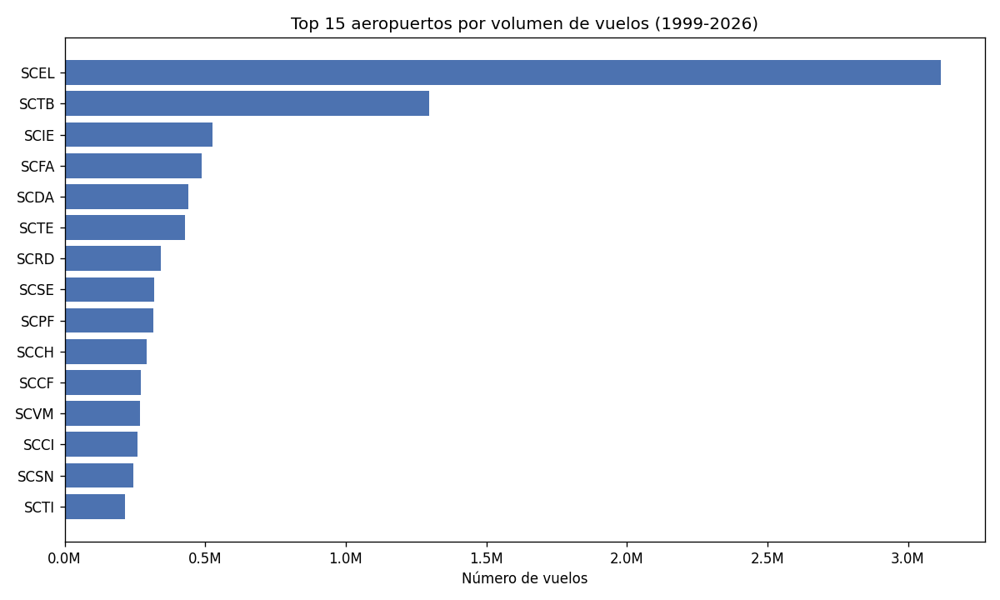

**¿Para que sirve?** Ver rapidamente cuales aeropuertos concentran el poder del sistema aereo chileno.

**¿Que descubrimos?** Santiago (SCEL) opera mas del doble que el segundo aeropuerto (Tobalaba, SCTB). El sistema es extremadamente asimetrico: el aeropuerto numero uno tiene mas trafico que los siguientes 14 juntos. Esto tiene implicancias directas en politica de infraestructura.

---

### ¿La imputacion del PMD altera la realidad del dato?

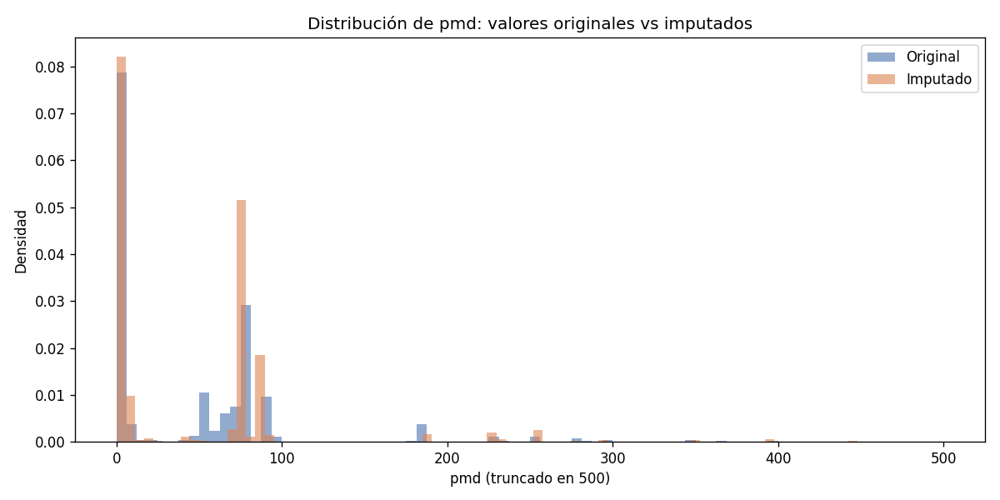

**¿Para que sirve?** Validar que rellenar los valores faltantes de PMD (Peso Maximo de Despegue) con la mediana del modelo de avion no introduce sesgo en el analisis.

**¿Que descubrimos?** Las dos curvas — valores originales e imputados — son casi identicas. El pequeño "pico" que aparece en los valores imputados es normal y esperable: **cuando se imputa con una mediana, todos los registros de un mismo modelo de avion reciben exactamente el mismo valor** (el valor central de ese grupo). Eso apila muchas observaciones en un solo punto del eje y crea una barra alta, pero **no distorsiona la distribucion real** — la masa sigue estando donde estaba. La fisica del avion no cambia: simplemente usamos la mejor estimacion disponible para ese modelo en vez de descartar el registro.

---

### ¿Como evoluciono el trafico en el tiempo?

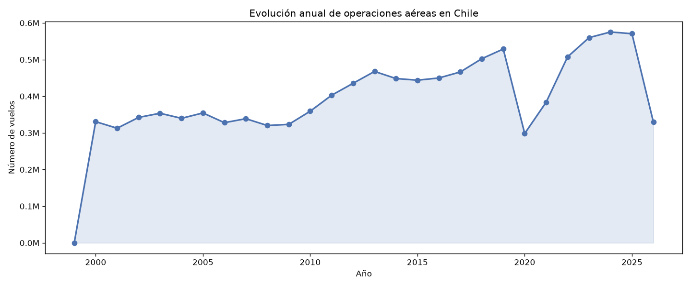

**¿Para que sirve?** Situar el periodo de la PoC (2020-2026) dentro de la serie historica completa, para saber si es un tramo representativo.

**¿Que descubrimos?** La pandemia parte la serie en dos: **el trafico cae un 44% entre 2019 y 2020** (de 528 890 a 298 358 vuelos) y no recupera el nivel previo hasta 2023. En 2024 lo supera (575 395 vuelos, un 109% de 2019). Esto es lo que justifica tratar 2020-2021 como un regimen operativo aparte, y es la razon del sesgo COVID que se documenta mas adelante.

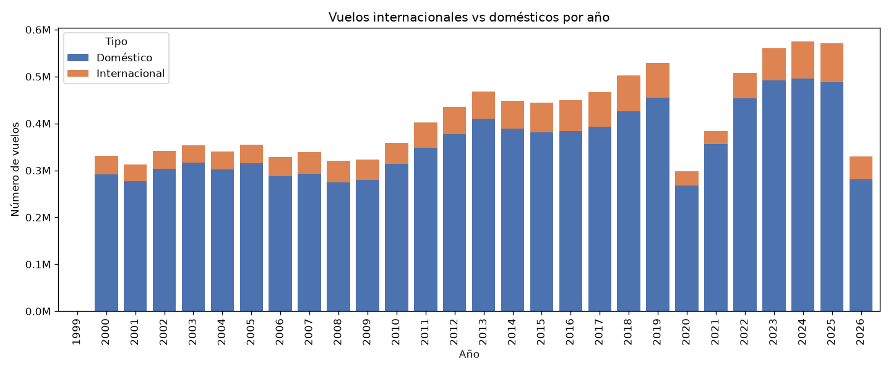

**¿Para que sirve?** Ver si la composicion del trafico —no solo su volumen— cambio con la crisis.

**¿Que descubrimos?** El trafico internacional se hundio mas y se recupero mas lento: del **14.0% de los vuelos en 2019 baja al 7.2% en 2021** y recien vuelve al 14.5% en 2025. Las fronteras cerraron antes y abrieron despues que los vuelos domesticos, y el dato lo refleja con nitidez.

### ¿Que aeropuertos concentran que tipo de operacion?

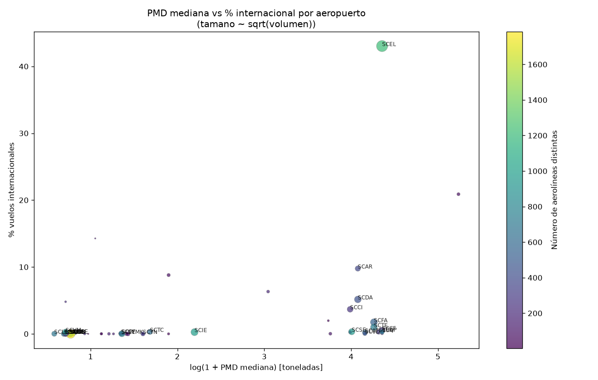

**¿Para que sirve?** Cruzar en un solo grafico el peso tipico de las aeronaves con el porcentaje de vuelos internacionales de cada aeropuerto.

**¿Que descubrimos?** **SCEL esta solo en su esquina**: es el unico punto que combina aeronaves pesadas con un alto porcentaje internacional. El resto se reparte entre aeropuertos de aviacion liviana casi sin vuelos internacionales y un grupo intermedio de aeronaves pesadas pero trafico nacional —los aeropuertos de carga y de larga distancia domestica, donde esta El Tepual. Es la misma estructura que despues encuentra el clustering, pero vista a ojo.

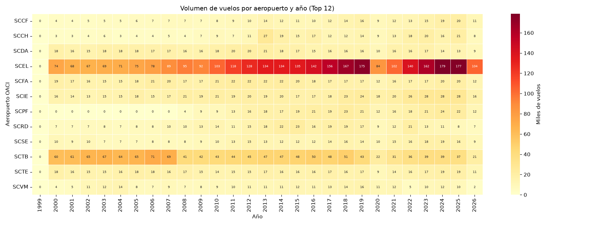

**¿Para que sirve?** Ver la evolucion de cada aeropuerto grande por separado, en vez del agregado nacional.

**¿Que descubrimos?** SCEL concentra el **28.2%** de todas las operaciones del pais, seguido de Tobalaba (SCTB) con 1.3 millones. La caida de 2020 es visible como una banda clara que cruza todas las filas —afecto a todos— pero **no con la misma intensidad**: los aeropuertos de aviacion general se recuperaron antes que los de transporte comercial.

### ¿Que variables se relacionan entre si?

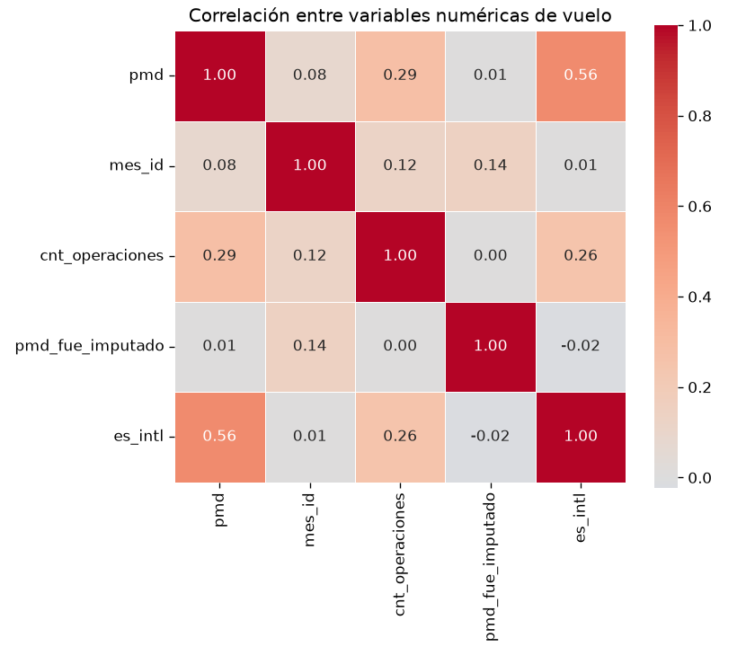

**¿Para que sirve?** Entender si el peso del avion, el mes y el volumen de operaciones tienen alguna relacion entre si antes de entrenar el modelo.

**¿Que descubrimos?** El PMD es, con diferencia, la variable mas ligada a que un vuelo sea internacional: **r = 0.56**. Los aviones pesados vuelan lejos, y esa sola relacion explica buena parte de lo que despues logra el clasificador. `cnt_operaciones` le sigue de lejos (r = 0.26): los aeropuertos con mas movimiento concentran mas trafico internacional.

Lo mas util, sin embargo, es lo que **no** aparece. El flag `pmd_fue_imputado` tiene correlacion **−0.003 con el PMD y −0.02 con `es_internacional`**: practicamente cero. Es decir, **los datos faltantes no se concentran en un tipo de avion ni en un tipo de vuelo** — faltan de forma esencialmente aleatoria. Esa es la mejor evidencia de que imputar con la mediana del modelo no introduce un sesgo sistematico, y es mas fuerte que la comparacion visual de distribuciones del grafico anterior.

`mes_id` no se correlaciona con nada (r ≤ 0.14 con todo), lo que descarta una tendencia temporal fuerte en el peso de las aeronaves.

> **Correccion respecto de una version anterior de este README.** Aqui se afirmaban r = 0.31 para PMD vs internacional y −0.24 para el flag vs PMD. Ambas cifras eran incorrectas y la segunda sostenia una conclusion falsa — que los faltantes se concentraban en aeronaves livianas. Los valores correctos son los de la matriz: **0.56 y −0.003**. Se deja constancia porque la conclusion cambia: los faltantes **no** tienen patron.

---

## Calidad de los datos — que encontramos al mirar de cerca

El EDA completo — `describe()` de las 16 columnas, del clima y del subconjunto de El Tepual, duplicados, outliers y analisis del target — se genera con el pipeline y vive en **[`data/08_reporting/eda_report.md`](data/08_reporting/eda_report.md)**. Se regenera en cada `kedro run`, asi que no puede quedar desactualizado respecto del codigo.

Lo que encontro, y que no se veia en los graficos:

**1. Hay 1 122 filas exactamente duplicadas** (0.01%) y 2 470 repeticiones de la llave `(fecha-hora, aeropuerto, matricula, tipo)`. **No se eliminan**: sin un identificador unico de operacion no se puede distinguir un registro repetido de dos movimientos reales muy seguidos, y borrarlos a ciegas sesgaria los conteos por aeropuerto.

**2. El 3% de los vuelos queda fuera del rango intercuartil del PMD — y son tres cosas distintas.** Recortar en 500 toneladas para graficar, como se hacia antes, escondia el problema en vez de diagnosticarlo:

| Situacion | Vuelos | Que es | Que se hizo |
|---|---|---|---|
| Fuselaje ancho (300–650 t) | 73 646 | B747, B777, A340 y el AN-225, que realmente pesa 640 t | **Se conservan.** Se transforman con logaritmo al modelar |
| **Error de unidad (> 650 t)** | **1 078** | Aviones livianos con el peso en **kilogramos**: un T-34 Mentor pesa 1.3 t y figura con 1 340; un helicoptero R-44 pesa 1.1 t y figura con 1 000 | **Se documentan, no se parchean.** Corregirlos exigiria un umbral que podria dañar registros validos. Ninguno entra en la PoC |
| **`pmd = 0`** | **25 821** | Un avion no puede pesar cero: son nulos disfrazados, y el 98.5% no venia marcado como vacio | **Corregido.** Ahora se tratan como faltantes y entran a la imputacion |

El tercero era un error nuestro: la primera version imputaba solo los `NaN`, asi que 25 821 vuelos llegaban al modelo como aeronaves sin peso. Al corregirlo, la tasa de imputacion sube de 2.5% a **2.72%**.

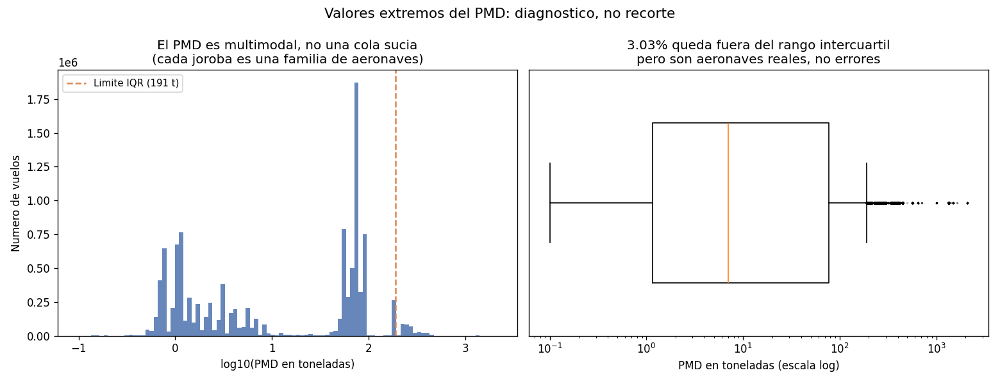

**¿Para que sirve?** Distinguir una cola larga legitima de una cola sucia. El panel izquierdo esta en escala logaritmica porque en escala lineal no se ve nada.

**¿Que descubrimos?** El PMD **no tiene una distribucion con outliers, tiene varias distribuciones superpuestas**: cada joroba es una familia de aeronaves — ultralivianos, aviacion general, turbohelices, jets regionales, fuselaje ancho. Por eso la regla del rango intercuartil marca un 3% de "outliers" que en su mayoria son aviones perfectamente normales, solo que de otra categoria. Es el argumento para transformar con logaritmo en vez de recortar.

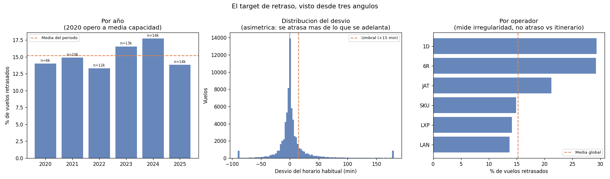

**¿Para que sirve?** Ver el target desde tres angulos antes de modelarlo: su evolucion, su forma y su reparto entre operadores.

**¿Que descubrimos?** El panel central es el importante: la distribucion del desvio es **claramente asimetrica** — cola izquierda corta, cola derecha larga. Esa asimetria es la firma de un retraso real; si fuera ruido de medicion seria simetrica. El panel izquierdo muestra que 2020 opero a menos de la mitad de volumen que 2024, lo que justifica tratar el periodo COVID como un regimen aparte.

---

## Modelado No Supervisado — Clustering

**Pregunta:** ¿Existen grupos naturales de aeropuertos segun su comportamiento operativo?

Agrupamos los 69 aeropuertos usando **K-Means** sobre cinco variables: volumen de vuelos, porcentaje internacional, PMD mediano, numero de aerolineas y promedio de operaciones mensuales (todo transformado con logaritmo para manejar la escala).

Probamos k=2 hasta k=8. El optimo matematico es **k=4** — mayor Silhouette Score (0.420) y punto de inflexion en la curva del codo.

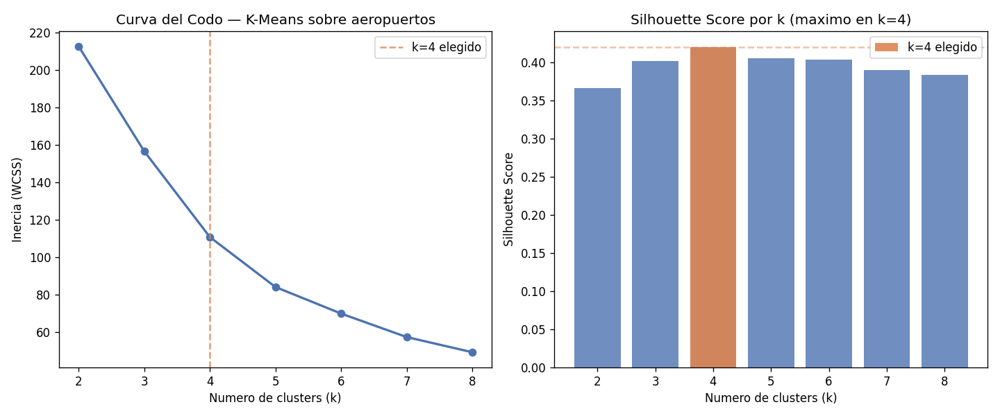

**¿Para que sirve?** Justificar el numero de grupos en vez de elegirlo a ojo. La curva del codo muestra donde dejan de ganarse compacidad, y el silhouette mide que tan bien separados quedan.

**¿Que descubrimos?** Ambos criterios coinciden en k=4, lo que da confianza: el codo se quiebra ahi y el silhouette alcanza su maximo (0.420). No siempre pasa — cuando no coinciden hay que decidir con criterio de negocio.

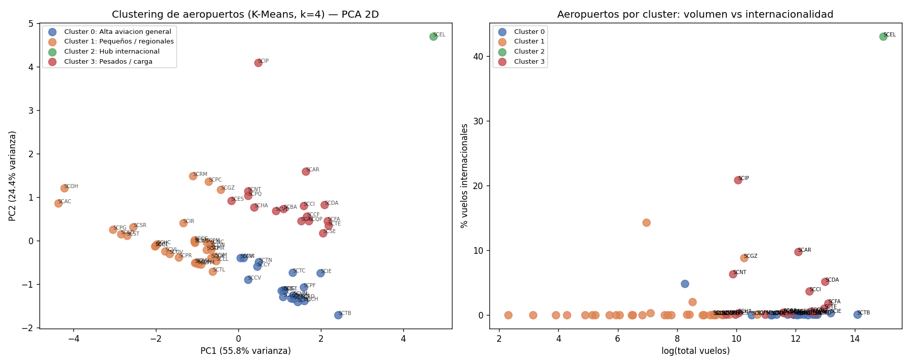

**¿Que grupos encontramos?**

| Cluster | Aeropuertos | Vuelos | % internacional | PMD medio | Caracter |
|---|---|---|---|---|---|
| **Pequeños / regionales** | 32 | 198 101 | 0.8% | 3.3 t | Poco trafico y aviones livianos |
| **Pesados / carga** | 16 | 2 892 379 | 3.2% | **68.5 t** | Volumen alto con aeronaves pesadas — aqui esta El Tepual (SCTE) |
| **Hub internacional** | 1 (SCEL) | 3 118 336 | **43.0%** | 77.0 t | El unico con perfil verdaderamente internacional |
| **Alta aviacion general** | 20 | **4 865 381** | 0.3% | **2.0 t** | El mayor volumen de todos, pero casi todo aviacion liviana (Tobalaba, Concepcion) |

> **Los nombres se derivan del perfil de cada grupo, no estan escritos a mano.** K-Means numera los clusters de forma arbitraria — el que hoy es el 1 puede ser el 3 en la proxima ejecucion — asi que etiquetarlos por indice garantiza que tarde o temprano el grafico diga una cosa y el dato otra. De hecho **eso ocurria**: una version anterior del codigo llamaba "Grandes internacionales" al grupo con 3.2% de vuelos internacionales, y "Medianos domesticos" a SCEL, que tiene 43%. Ahora el nombre sale de las caracteristicas del grupo, y figura, codigo y tabla no pueden contradecirse.

> SCEL forma un cluster propio. Es tan distinto al resto que el algoritmo lo aisla solo — lo cual tiene todo el sentido operativo.

---

## Modelado Supervisado — Clasificacion

**Pregunta:** ¿Podemos predecir si un vuelo es internacional solo con sus datos operativos?

**Por que esta variable objetivo:** `es_internacional` es la distincion mas relevante para planificar infraestructura aeroportuaria — define requisitos de aduana, rampa, gate y personal. Si podemos predecirla con precision, podemos anticipar necesidades antes de que ocurran.

**El desafio:** solo el 12.8% de los vuelos son internacionales. Para que el modelo no ignore esta clase minoritaria, entrenamos con `class_weight="balanced"`.

**Modelo:** RandomForestClassifier — 200 arboles, profundidad maxima 12, semilla 42.
**Muestra:** 500 000 filas (estratificadas), split 80/20.

### ¿Que variables importan mas?

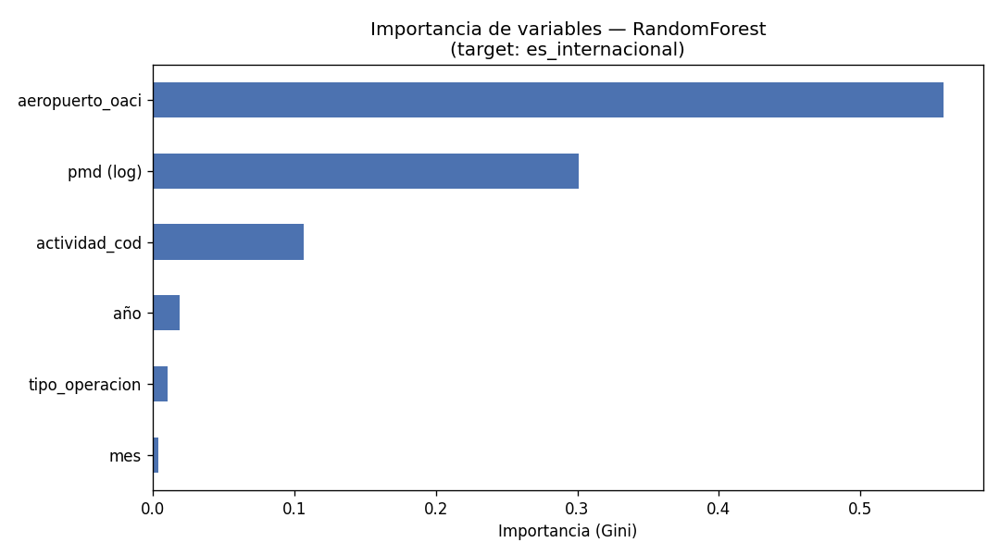

**¿Para que sirve?** Ver cuales datos son los que realmente le permiten al modelo distinguir un vuelo internacional.

**¿Que descubrimos?** El **aeropuerto** es el predictor dominante — tiene sentido: solo ciertos aeropuertos tienen rutas internacionales. El **PMD** (peso del avion) es el segundo predictor: los aviones mas pesados casi siempre vuelan mas lejos. El mes y el año tambien aportan — el trafico internacional tiene estacionalidad y ha crecido con los años.

### ¿Que tan bien discrimina el modelo?

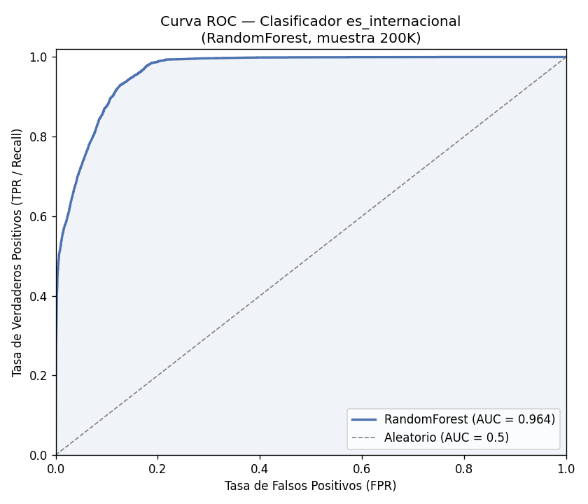

**¿Para que sirve?** Medir la capacidad del modelo para separar vuelos internacionales de domesticos en cualquier umbral de decision.

**¿Que descubrimos?** Un **ROC-AUC de 0.964** significa que el modelo clasifica correctamente el 96.4% de los pares vuelo-internacional vs. vuelo-domestico. La validacion cruzada de 5 particiones confirma que este resultado es estable (0.963 ± 0.001) — no es suerte de una sola particion.

### ¿Donde se equivoca?

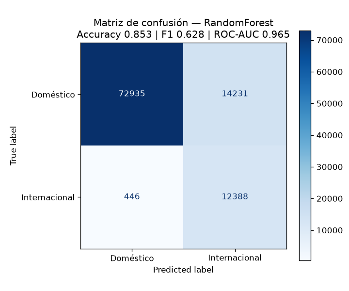

**¿Para que sirve?** Ver el tipo de error, no solo cuanto error hay. Un modelo con la misma exactitud puede fallar de maneras muy distintas.

**¿Que descubrimos?** Casi todo el error esta en un solo cuadrante: vuelos domesticos clasificados como internacionales. Es el precio deliberado de priorizar el recall — el modelo prefiere marcar de mas antes que dejar pasar un vuelo internacional sin gate. La columna de falsos negativos es minima, que es justo lo que se buscaba.

### Metricas del modelo

| Metrica | Valor | Que significa en la practica |
|---|---|---|
| **ROC-AUC** | 0.964 | Excelente capacidad de discriminacion global |
| **Recall** | 0.963 | Detecta el 96.3% de los vuelos internacionales reales |
| **Precision** | 0.465 | De cada 10 predichos como "internacional", ~5 realmente lo son |
| **F1** | 0.628 | Balance entre precision y recall |
| **Accuracy** | 0.853 | 8 de cada 10 predicciones son correctas |

> El Recall alto es una decision deliberada: en planificacion de infraestructura, es peor no detectar un vuelo internacional (y quedarse sin gate) que sobreestimarlo.

---

# Prediccion de Retrasos — PoC Puerto Montt

## Impacto de Negocio — por que predecir retrasos

El modelo base predice *que tipo* de vuelo es. Util, pero no mueve la aguja economica. **El retraso si.** Cada minuto que un avion se demora consume combustible en tierra, horas de tripulacion, uso de gate y compensaciones a pasajeros. Por eso el retraso se usa aqui como **variable proxy del costo operativo**: no tenemos las facturas de la aerolinea, pero si tenemos los minutos, y los minutos cuestan dinero.

**Por que solo Puerto Montt.** Procesar los 69 aeropuertos multiplicaria el costo computacional sin agregar conocimiento nuevo en esta etapa. El Tepual (SCTE) es un buen banco de pruebas: tiene volumen suficiente (80 323 operaciones regulares en el periodo), 22 aerolineas, 263 numeros de vuelo distintos, y un clima lo bastante hostil como para que la hipotesis del clima sea razonable — **llueve el 44.9% de los dias**. Escalar a todo Chile es un problema de infraestructura, no de metodo (ver [Trabajo futuro](#trabajo-futuro)).

**Por que solo 2020–2026.** Se descartaron los datos de 1999 a 2019. Eso baja el parquet de 11 millones de filas a 80 mil, acelera el entrenamiento, y sobre todo evita que el modelo aprenda patrones de una infraestructura que ya no existe.

---

## Como se construye el retraso si el dato no lo trae

Esta es la parte mas importante de esta seccion y la primera pregunta que corresponde hacer en una defensa.

**El plan original era restar la hora programada de la hora real.** Al abrir el parquet quedo claro que eso no se puede hacer: la bitacora JAC tiene **una sola marca de tiempo**.

```
dt_operacion: timestamp[us, tz=America/Santiago]   ← la hora REAL de la operacion
aeropuerto_oaci, tipo_operacion, aeropuerto_dgac_orig_dest,
aerolinea_dgac, numero_vuelo, actividad_cod, matricula,
modelo_avion, modelo_avion_desc, es_internacional, pmd
```

No hay hora programada. No hay itinerario publicado. Restar "programada − real" es imposible con esta fuente.

### La solucion: reconstruir el horario desde la propia bitacora

Un vuelo regular opera a la misma hora todos los dias. Si LATAM 61 aterriza a las 11:11, 11:32, 11:33, 11:05, 11:18… su **horario habitual** es ~11:15. El vuelo que ese dia llego a las 12:40 se retraso. La referencia no es el itinerario oficial, pero es una reconstruccion razonable de el.

El horario de referencia se calcula como la **mediana del slot habitual** de cada combinacion de `aerolinea + numero_vuelo + tipo_operacion + mes + dia de la semana`. Tres detalles hicieron la diferencia entre una medida util y ruido puro:

**1. El reloj es circular.** Un vuelo de las 23:50 y otro de las 00:10 distan 20 minutos, no 1420. Sin corregir esto, los vuelos nocturnos destruian la medida: un vuelo de JetSmart programado a las 22:00 que a veces despega 00:31 producia una "mediana" a mitad de la tarde, una hora en la que ese vuelo nunca opero.

**2. Un mismo numero de vuelo puede tener dos slots.** LATAM 61 llega **~07:16 los sabados** y **~19:34 lunes y miercoles**. Promediar ambos da un horario que no existe. El algoritmo separa los slots buscando huecos de mas de 120 minutos en el reloj circular, y compara cada operacion contra el centro del slot mas cercano.

**3. Las aerolineas programan por dia de la semana.** Agregar el dia de la semana a la agrupacion fue lo que mas mejoro la medida.

El efecto acumulado de las tres correcciones, medido sobre las mismas 80 323 operaciones:

| Version del calculo | Desv. estandar | p05 | p95 | % "retrasados" |
|---|---|---|---|---|
| Mediana simple de la hora | 161.8 min | −248 min | +270 min | 31.3% |
| + reloj circular | 155.4 min | −241 min | +253 min | 30.4% |
| + deteccion de slots | 71.3 min | −90 min | +110 min | 26.4% |
| + dia de la semana **(version final)** | **57.5 min** | **−27.5 min** | **+50.5 min** | **14.4%** |

**Como sabemos que la reconstruccion es correcta.** El criterio de validacion es la **cola izquierda**: un avion comercial casi nunca despega mucho *antes* de su horario — los pasajeros no han embarcado. Si la referencia estuviera mal, veriamos multitud de vuelos "adelantados" horas, que es exactamente lo que pasaba en las primeras versiones (p05 = −248 min, es decir mas de 4 horas antes: imposible).

Notese tambien como la tasa de "retraso" cae de 31.3% a 14.4% al ir corrigiendo el calculo: **mas de la mitad de los retrasos que mostraba la version ingenua eran errores de medicion, no retrasos.**

Sobre los 71 606 vuelos que finalmente conservan horario de referencia, el desvio se distribuye asi:

| p05 | p25 | p50 | p75 | p95 |
|---|---|---|---|---|
| −29 min | −5.5 min | **0 min** | +7 min | +52 min |

La distribucion esta centrada en cero, la cola izquierda es corta y plausible, y la cola derecha es larga. **Esa asimetria es la firma de un retraso real**: los vuelos se atrasan mucho y se adelantan poco. Si la medida fuera ruido, seria simetrica.

### El target

- Se conservan solo los vuelos de **transporte publico regular** (`actividad_cod = 'U'`): sin itinerario no existe la nocion de retraso.
- Se exigen al menos 3 observaciones por grupo para aceptar su horario de referencia. Esto deja **71 606 vuelos (89.1%)** del recorte.
- `retraso = 1` si el vuelo opero **mas de 15 minutos** despues de su horario habitual.
- **Tasa de retraso global: 15.2%.**

### Lo que esta medida NO es

Honestidad sobre los limites, porque van a preguntar:

- **Mide irregularidad, no retraso oficial.** Si un vuelo sale sistematicamente 20 minutos tarde todos los dias, su horario habitual *incluye* esos 20 minutos y el modelo lo considera puntual. La medida captura desviaciones del comportamiento tipico, no del itinerario publicado.
- **Es conservadora.** Si un dia entero se retrasa completo, parte de ese retraso se absorbe en la mediana del grupo. Subestima, no sobreestima.
- **Depende de la regularidad.** Funciona para LATAM, Sky y JetSmart; no funcionaria para aviacion general o vuelos charter, que por eso se excluyen.
- **La hora programada que usa el modelo se calcula con datos del mismo mes.** En produccion se usaria el itinerario publicado; aqui se reconstruye con informacion que en rigor todavia no estaria disponible. Es un sesgo optimista leve, y aun asi el modelo apenas supera el azar — con el itinerario real el resultado no seria mejor por este motivo.

> **Lo que si esta correctamente aislado:** el modelo nunca ve la hora *real* de la operacion, que es justo lo que debe predecir. Solo recibe la hora *programada*. Confundir ambas inflaria las metricas de forma espectacular y falsa.

---

## El cruce con el clima

El clima diario de Meteostat (estacion 85799, Puerto Montt) se une a los vuelos con un **LEFT JOIN por un solo campo**: `fecha_cruce`, en formato `YYYY-MM-DD`. Ambos lados se normalizan eliminando hora y zona horaria, justamente para que el merge sea barato y no colapse la memoria.

**Resultado del cruce: 71 606 vuelos, 0 filas sin clima.** Cobertura perfecta, porque el CSV cubre los 2 192 dias del periodo sin faltantes.

Ademas de las variables crudas (temperatura, lluvia, viento, presion) se derivan dos que si tienen sentido aeronautico:

- **Viento cruzado.** Un viento de 40 km/h alineado con la pista casi no molesta; el mismo viento de costado puede cerrar el aeropuerto. El Tepual tiene pista **17/35** (rumbo 170°), asi que el viento se descompone en su componente perpendicular: `viento_cruzado = wspd × |sin(wdir − 170°)|`.
- **Amplitud termica** (`tmax − tmin`), como proxy de inestabilidad atmosferica.

> **Nota metodologica:** tambien se probo el clima **horario** de Meteostat (temperatura, punto de rocio, humedad y codigo de condicion hora a hora, cruzado con `merge_asof` contra la hora exacta de cada vuelo). No cambio la conclusion: la señal siguio siendo practicamente nula. Se mantuvo el cruce diario por ser mas simple, mas reproducible y tener mejor cobertura.

---

## ¿Cuanto retrasa realmente el clima?

Esta es la pregunta que motivo todo el pipeline. La respuesta tiene dos partes y ninguna es la esperada.

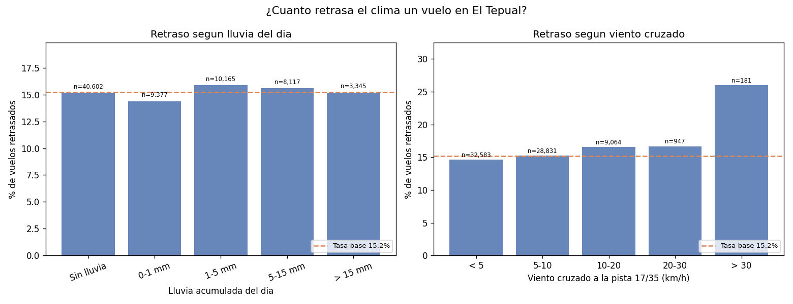

**¿Para que sirve?** Comparar directamente la tasa de retraso en dias con y sin mal tiempo. La linea naranja es la tasa base (15.2%): si las barras no se despegan de ella, el clima no esta haciendo nada.

**¿Que descubrimos?**

**1. La lluvia no retrasa vuelos en Puerto Montt.** Ninguna barra se separa de la tasa base. Un dia con mas de 15 mm de lluvia tiene una tasa de retraso de 15.19% — contra 15.14% en dias completamente secos. La diferencia es de **0.05 puntos porcentuales**, es decir, nada.

| Lluvia del dia | Vuelos | Tasa de retraso | vs. base |
|---|---|---|---|
| Sin lluvia | 40 602 | 15.14% | −0.05 pts |
| 0–1 mm | 9 377 | 14.38% | −0.82 pts |
| 1–5 mm | 10 165 | 15.86% | +0.66 pts |
| 5–15 mm | 8 117 | 15.57% | +0.38 pts |
| **> 15 mm** | 3 345 | **15.19%** | **−0.01 pts** |

La explicacion es operativa, no estadistica: **en Puerto Montt llueve el 44.9% de los dias**. Un aeropuerto que opera bajo lluvia casi la mitad del año esta diseñado, equipado y entrenado para la lluvia. La lluvia ahi no es una anomalia — es la condicion normal.

**2. El viento cruzado si retrasa, pero solo en el extremo.** Aqui si aparece una señal, y es fuerte:

| Viento cruzado | Vuelos | Tasa de retraso | vs. base |
|---|---|---|---|
| < 5 km/h | 32 583 | 14.65% | −0.54 pts |
| 5–10 km/h | 28 831 | 15.26% | +0.07 pts |
| 10–20 km/h | 9 064 | 16.55% | +1.35 pts |
| 20–30 km/h | 947 | 16.68% | +1.49 pts |
| **> 30 km/h** | **181** | **25.97%** | **+10.77 pts** |

Con mas de 30 km/h de viento perpendicular a la pista, la tasa de retraso **casi se duplica**: de 14.7% a 26.0%. El efecto es real y tiene sentido fisico — es el viento cruzado, no la lluvia, lo que limita un aterrizaje.

**Pero ese escenario ocurre en 181 de 71 606 vuelos: el 0.25%.** Y ahi esta la clave de todo el proyecto.

---

## El Score de Riesgo Operativo

El modelo entrega `predict_proba` — un numero continuo de 0% a 100% — en vez de una etiqueta si/no. Asi el gerente elige el umbral segun lo que le cueste cada tipo de error, en lugar de heredar el 50% por defecto.

### Como se evalua (y por que no con un split aleatorio)

El modelo se ofrece como pronostico a futuro, asi que evaluarlo con un split aleatorio seria hacer trampa: pondria vuelos del mismo dia en entrenamiento y en prueba, y el modelo veria el clima de un dia que ya conoce. El split es **temporal y de tres tramos**:

| Tramo | Periodo | Vuelos | Para que |
|---|---|---|---|
| Entrenamiento | 2020–2023 | 42 067 | Aprender |
| Validacion | 2024 | 14 850 | Elegir modelo e hiperparametros |
| **Prueba** | **2025+** | **14 689** | Se toca **una sola vez** |

### Que dos algoritmos, y por que

| Algoritmo | Por que entra | Configuracion final |
|---|---|---|
| **HistGradientBoosting** | Es el estandar para datos tabulares: captura interacciones no lineales entre hora, aerolinea y clima sin pedir escalado ni codificacion previa, y maneja nulos de forma nativa | `max_iter=150, learning_rate=0.05, max_depth=4, min_samples_leaf=50, l2=1.0` |
| **Regresion Logistica** | Entra como contraparte deliberadamente simple. **Si un modelo lineal iguala al boosting, es señal de que no hay estructura no lineal que aprender** — y eso es exactamente lo que ocurrio. Ademas entrega probabilidades calibradas de fabrica, que es lo que necesita un score leido como porcentaje | `C=1.0` (regularizacion L2 moderada) |

El problema es una **clasificacion binaria desbalanceada** (15% de positivos), asi que ademas de ROC se reporta **Average Precision**, que compara contra la tasa base en vez de contra el azar.

### Como se eligio la configuracion (y no a ojo)

Se evaluaron **30 configuraciones** — 6 del boosting y 4 de la logistica, por cada uno de los 3 conjuntos de variables. Cada una se ajusta con el tramo de entrenamiento y se puntua contra **2024**; el tramo de prueba no participa en ninguna decision.

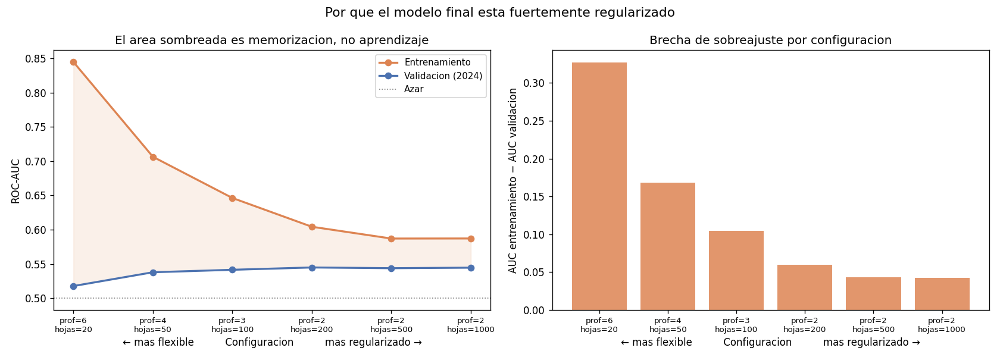

**¿Para que sirve?** Mostrar que la regularizacion agresiva del modelo final es una conclusion del dato, no una decision arbitraria.

**¿Que descubrimos?** La version flexible del boosting — la configuracion con la que cualquiera empezaria — alcanza **ROC-AUC 0.845 en entrenamiento y 0.518 en validacion**. Esa brecha de 0.33 es memorizacion pura: el modelo aprende el ruido de 2020-2023 y no le sirve de nada en 2024.

A medida que se restringe la profundidad y se exige mas observaciones por hoja, el AUC de entrenamiento cae **y el de validacion sube**. El optimo esta en el extremo podado: arboles de **profundidad 2** con 200 observaciones minimas por hoja, que logran el mejor AUC de validacion (0.545) con una brecha de apenas **0.059**.

> Este grafico es la respuesta a "¿por que su modelo es tan simple?". Porque cualquier cosa mas compleja memoriza en vez de aprender, y lo podemos demostrar.

### El experimento que responde la pregunta

Cada modelo se entrena **tres veces**: solo con variables de operacion, solo con clima, y con ambas. Si sumar el clima no mueve el AUC, el clima no explica el retraso. Resultados sobre 2025 (tasa base 13.8%):

| Variables | Modelo | AUC train | AUC validacion | **AUC test** |
|---|---|---|---|---|
| **Solo operacion** | **GradientBoosting** | 0.637 | **0.569** | **0.524** ✅ |
| Solo operacion | Regresion Logistica | 0.555 | 0.540 | 0.533 |
| Solo clima | GradientBoosting | 0.565 | 0.510 | **0.469** |
| Solo clima | Regresion Logistica | 0.526 | 0.519 | 0.488 |
| Clima + operacion | GradientBoosting | 0.604 | 0.545 | 0.513 |
| Clima + operacion | Regresion Logistica | 0.559 | 0.536 | 0.522 |

**Tres lecturas, todas incomodas y todas honestas:**

1. **Con solo clima, el modelo queda por debajo del azar** (AUC 0.469 y 0.486, contra 0.5 de una moneda). El clima diario, por si solo, no contiene informacion util sobre si un vuelo se va a retrasar.
2. **Agregar el clima a las variables de operacion empeora el modelo** (0.533 → 0.518 con el mejor de cada conjunto). No es un error de codigo: es el comportamiento clasico de una variable que aporta ruido en vez de señal, y que el modelo termina usando para memorizar el pasado.
3. **Ningun modelo pasa de AUC 0.533.** Eso es apenas mejor que el azar. El pipeline selecciona automaticamente el ganador por el año de validacion, y **el ganador no usa clima**.

> **Por que el modelo entregado marca 0.524 y no 0.533.** El mejor resultado en la tabla de prueba lo logra la regresion logistica (0.533), pero el pipeline **no la elige**: selecciona por el año de validacion, donde gana el gradient boosting (0.569 contra 0.540), y ese obtiene 0.524 en prueba.
>
> Elegir el 0.533 seria mirar el conjunto de prueba para decidir — exactamente lo que el split de tres tramos existe para impedir. **Que el ganador por validacion no sea el mejor en prueba es informacion, no un error**: con diferencias de esta magnitud entre modelos, el orden entre ellos es ruido. Es una razon mas para no desplegar ninguno.

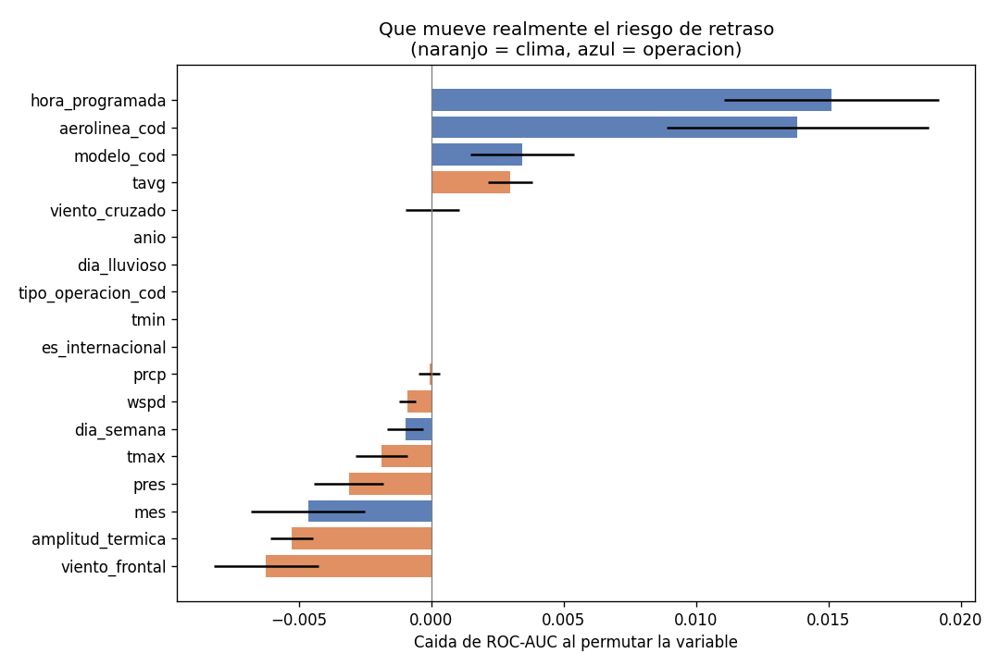

**¿Para que sirve?** Medir cuanto pierde el modelo si se destruye una variable (importancia por permutacion). A diferencia de la importancia Gini, esta no premia a las variables con muchos valores distintos, asi que comparar clima contra operacion es justo. Las barras negativas indican variables que **empeoran** el modelo.

**¿Que descubrimos?** Las dos unicas variables con aporte real son **la hora programada** y **la aerolinea** — ambas operativas (azul). Todas las variables de clima (naranjo) estan pegadas a cero o en negativo. `amplitud_termica` es la peor de todas: el modelo la uso para memorizar el pasado y en 2025 le costo AUC.

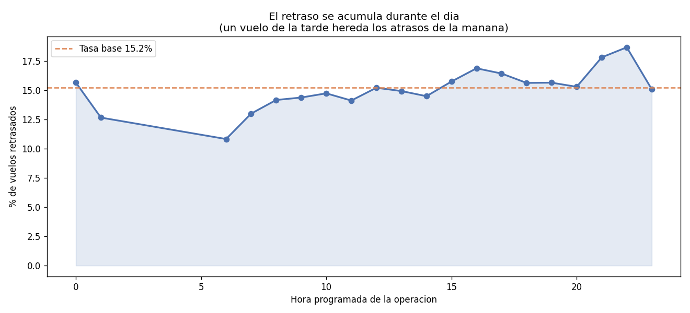

**¿Para que sirve?** Ver el unico patron que el modelo si logra capturar: como se acumula el retraso a lo largo de la jornada.

**¿Que descubrimos?** Un vuelo programado a las 06:00 tiene 10.8% de probabilidad de retrasarse; uno programado a las 22:00, 18.7%. El avion de la tarde hereda los atrasos de la mañana — es propagacion en la rotacion de la flota, no clima.

> **Un sesgo que corregimos en el camino:** una version preliminar de este analisis media la hora *real* de la operacion en vez de la programada, y mostraba un efecto mucho mas dramatico (7.6% a las 06:00 contra 21.7% a las 21:00). Ese efecto era en parte artificial: **un vuelo retrasado se mueve solo hacia horas mas tardias**, asi que las horas de la noche concentran retrasos por construccion. Usando la hora programada — la unica que un planificador conoce por anticipado — el efecto real es la mitad.

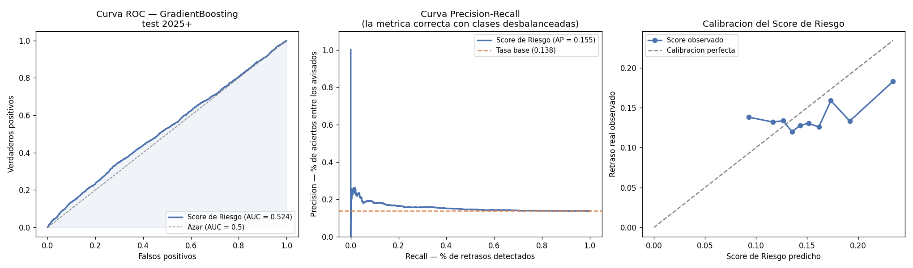

**¿Para que sirve?** El panel izquierdo mide la discriminacion; el derecho verifica que el score se pueda leer como porcentaje (que un score de 30% corresponda de verdad a un 30% de vuelos retrasados).

**¿Que descubrimos?** La curva ROC se despega apenas de la diagonal del azar (AUC 0.524). El panel de calibracion es aun mas elocuente: **todos los scores del modelo caben entre 13.5% y 19%**. El modelo esta prediciendo casi la tasa base para todos los vuelos, porque no encontro nada que le permita distinguirlos. Esta bien calibrado — y es casi inutil para decidir.

### Metricas finales del Score de Riesgo

| Metrica | Valor | Que significa |
|---|---|---|
| ROC-AUC (test 2025) | **0.524** | Apenas sobre el azar (0.5) |
| Average Precision | 0.155 | Contra una tasa base de 0.138 |
| Lift vs azar | **1.12** | Solo un 12% mejor que adivinar |
| Brier score | 0.119 | Bien calibrado, pero sobre un rango estrecho |
| Tasa base en test | 13.8% | El 13.8% de los vuelos de 2025 se retrasaron |

**Veredicto honesto: este modelo no esta listo para produccion.** Un lift de 1.12 no sostiene una decision operativa. Se entrega documentado como lo que es — evidencia de que la hipotesis inicial no se cumple con estos datos, y una arquitectura lista para recibir mejores insumos.

---

## Aprendizaje no supervisado sobre el problema de retrasos

El clustering de aeropuertos del baseline responde una pregunta distinta (como se parecen entre si los aeropuertos de Chile). Aqui el objetivo es descubrir estructura **dentro del problema de negocio**, y se ataca por dos vias que responden preguntas diferentes.

### Como se elige k, y por que no basta el silhouette

En ambos casos se recorre k = 2 a 8 y se elige por silhouette, **pero con una condicion de tamano: ningun grupo puede quedar bajo el 2% del total.**

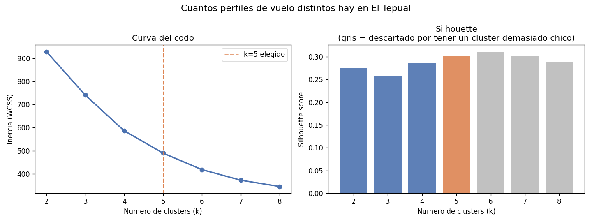

**¿Para que sirve?** El silhouette por si solo premia particiones que aislan un puñado de casos raros en un grupo propio: matematicamente compactas, inutiles para decidir.

**¿Que descubrimos?** En la segmentacion de vuelos el maximo silhouette esta en **k=6 (0.310)**, pero su grupo mas chico contiene solo el **1.6%** de los slots — un cluster de 4 vuelos sobre el que nadie va a tomar una decision. La regla lo descarta y elige **k=5 (0.302)**, donde el grupo mas chico ya reune el 6.7%. Las barras grises del grafico son los k rechazados por esa razon.

---

### Via 1 — ¿Que vuelos concentran el riesgo?

Se agrupan los **253 slots de vuelo** (aerolinea + numero + tipo de operacion, con al menos 30 operaciones) por su comportamiento historico: hora programada, tasa de retraso, variabilidad, porcentaje de retrasos severos y volumen.

> **Esta segmentacion es descriptiva, no predictiva.** Incluye la puntualidad entre las variables de agrupacion a proposito. Por eso decir "los grupos difieren en puntualidad" seria circular — lo que aporta valor es **cuales** vuelos caen en el grupo critico y **que tan concentrado** esta el riesgo.

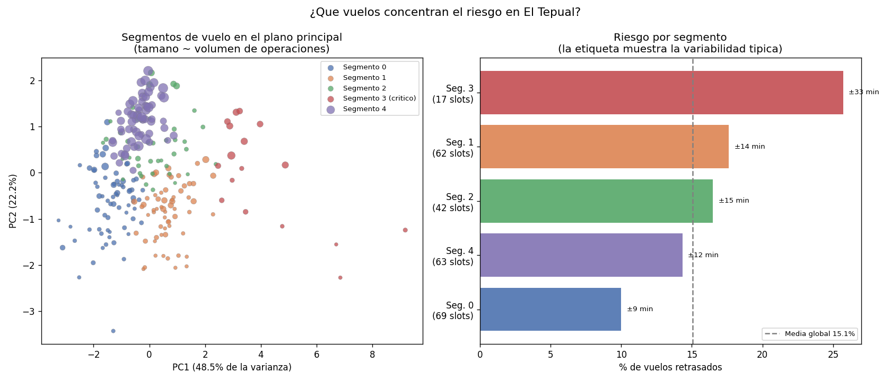

**¿Para que sirve?** Darle al jefe de operaciones una lista corta y accionable en vez de una tasa promedio que no le dice donde intervenir.

**¿Que descubrimos?** Cinco perfiles de vuelo bien separados (el plano principal retiene el **70.7%** de la varianza):

| Segmento | Slots | Vuelos | Hora tipica | Tasa de retraso | Variabilidad | Severos | Lectura |
|---|---|---|---|---|---|---|---|
| **3 — Criticos** | **17** | 3 904 | 15:10 | **25.7%** | **±33 min** | **11.8%** | Erraticos y con retrasos largos |
| 1 — Matinales irregulares | 62 | 5 815 | 12:19 | 17.6% | ±14 min | 6.6% | Volumen medio, algo inestables |
| 2 — Vespertinos | 42 | 3 731 | 18:28 | 16.5% | ±15 min | 2.9% | Tarde, pero sin retrasos largos |
| 4 — Troncales | 63 | **49 148** | 14:39 | 14.3% | ±12 min | 3.5% | El grueso del trafico, en la media |
| **0 — Puntuales** | 69 | 6 505 | 12:16 | **10.0%** | **±9 min** | 2.0% | El benchmark de la operacion |

**El hallazgo accionable: 17 slots — el 6.7% de los vuelos programados, apenas el 5.6% de las operaciones — tienen una tasa de retraso de 25.7%, mas del doble que el segmento puntual.** No hace falta intervenir todo El Tepual: hace falta intervenir 17 vuelos.

Y el contraste entre los segmentos 0 y 3 senala donde esta el problema: **no es la hora** (12:16 contra 15:10, ambos en horario normal) sino la **variabilidad**, que pasa de ±9 a ±33 minutos. El segmento critico no es tardio de forma sistematica: es impredecible.

> **Advertencia obligatoria antes de usar esta tabla.** 13 de los 17 slots criticos son de una misma aerolinea. Eso **no** significa que sea la menos puntual: el target mide desviacion respecto del horario *habitual de cada vuelo*, asi que penaliza la irregularidad y no el atraso cronico (ver [Etica, sesgos y privacidad](#etica-sesgos-y-privacidad), sesgo *c*). Una aerolinea que siempre sale 20 minutos tarde aparece como puntual. **Esta segmentacion sirve para priorizar donde poner buffer operativo, no para comparar aerolineas entre si.**

---

### Via 2 — ¿Existe un arquetipo de dia malo?

Aqui la pregunta es distinta y el diseño tambien: los **2 019 dias** se agrupan **solo por sus condiciones** — carga operativa, numero de aerolineas, lluvia, viento cruzado, velocidad del viento, temperatura, amplitud termica y presion. La puntualidad **no entra al clustering**; se usa despues, unicamente para etiquetar los grupos ya formados.

> Eso convierte esta via en una **prueba legitima e independiente**. Si las condiciones de operacion contuvieran informacion sobre el retraso, los grupos formados solo con ellas deberian separarse tambien en puntualidad. Es un test del mismo hallazgo del modelo supervisado, por un camino que no usa etiquetas.

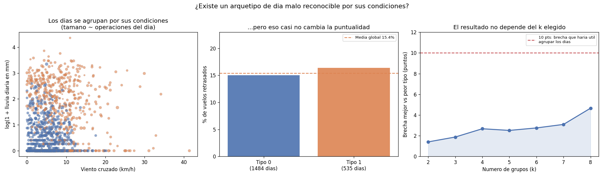

**¿Para que sirve?** Verificar el resultado central del proyecto sin usar un modelo supervisado, para descartar que sea un artefacto de como entrenamos.

**¿Que descubrimos?** El algoritmo separa limpiamente los dos arquetipos meteorologicos que uno esperaria en Puerto Montt:

| Tipo de dia | Dias | Lluvia media | Viento cruzado | Operaciones/dia | Tasa de retraso |
|---|---|---|---|---|---|
| **0 — Seco y calmo** | 1 484 | 0.6 mm | 4.9 km/h | 35.6 | **15.0%** |
| **1 — Lluvioso y ventoso** | 535 | **7.9 mm** | **9.0 km/h** | 33.8 | **16.4%** |

**El dia lluvioso y ventoso existe, esta perfectamente identificado... y se retrasa solo 1.4 puntos mas que el dia seco y calmo.**

El tercer panel cierra la puerta a la objecion obvia — "eligieron un k que les convenia": la brecha entre el mejor y el peor tipo de dia se midio para **todos** los k entre 2 y 8, y **nunca supera 4.7 puntos**. Para que agrupar los dias por condiciones fuera operativamente util, esa brecha tendria que rondar los 10 puntos.

**Las dos vias, supervisada y no supervisada, llegan al mismo lugar por caminos independientes.** El clima define con claridad como es un dia en El Tepual; no define si ese dia se va a retrasar.

---

## Interpretacion del desempeño — que significa cada numero

Un AUC no es una recomendacion. Esta seccion traduce cada metrica a la decision que habilita — o que impide.

| Metrica | Valor | Que significa tecnicamente | Que significa para el negocio |
|---|---|---|---|
| **ROC-AUC** | 0.524 | Ante un vuelo retrasado y uno puntual tomados al azar, el modelo ordena bien el par el 52.4% de las veces | Casi una moneda. **No habilita ninguna decision** que dependa de distinguir un vuelo de otro |
| **Average Precision** | 0.155 | Precision media a lo largo de todos los umbrales, contra una tasa base de 0.138 | Si el modelo avisa de 100 vuelos, ~15 se retrasaran; sin modelo, avisando al azar, ~14. **Un vuelo de diferencia** |
| **Lift** | 1.12 | El modelo es un 12% mejor que adivinar segun la tasa base | El umbral de despliegue era 1.50. **Queda muy lejos** |
| **Brier score** | 0.119 | Error cuadratico medio de las probabilidades | El modelo **no miente sobre su incertidumbre**: cuando dice 15%, ocurre el 15%. Es honesto, y eso es lo unico que salva |
| **Rango del score** | 13.5% – 19% | Todas las predicciones caben en 5.5 puntos | **Es el numero mas revelador.** El modelo le asigna practicamente el mismo riesgo a todos los vuelos porque no encontro nada que los distinga |

### La diferencia entre ROC y Precision-Recall, y por que importa aqui

Con solo un 13.8% de positivos, **la curva ROC hace ver al modelo mejor de lo que es**: premia acertar en la clase mayoritaria, que es la facil. La curva Precision-Recall compara contra la tasa base, y ahi se ve que la curva del modelo se pega a la linea de referencia casi en todo su recorrido. Por eso se reportan ambas y la decision se toma con la segunda.

### El contraste que prueba que la metodologia funciona

La objecion mas razonable a este proyecto es: *"¿el modelo falla, o fallaron ustedes construyendolo?"*. La respuesta esta en comparar los dos modelos supervisados del proyecto, construidos con **la misma arquitectura, el mismo equipo y el mismo pipeline**:

| Modelo | Target | ROC-AUC | Veredicto |
|---|---|---|---|
| RandomForest (baseline) | ¿Es internacional este vuelo? | **0.964** | Listo para produccion |
| GradientBoosting (PoC) | ¿Se retrasara este vuelo? | **0.524** | No se despliega |

**Mismo metodo, resultados opuestos.** Cuando la señal existe en los datos, este pipeline la encuentra y la explota hasta un AUC de 0.964. Cuando no existe, lo reporta. La diferencia entre 0.964 y 0.524 **es una propiedad de los datos, no de como se modelo.**

### De las metricas a las recomendaciones

| Hallazgo | Recomendacion operativa | Respaldo |
|---|---|---|
| El clima no predice el retraso | **No construir un sistema predictivo climatico.** Ahorra el costo de desarrollo y mantencion de un modelo que no decide nada | AUC 0.524; el clima solo resta 0.015 |
| El viento cruzado > 30 km/h duplica el retraso, pero ocurre en el 0.25% de los vuelos | **Una alerta por umbral, no un modelo.** Cuando el pronostico supere 30 km/h de componente cruzada, activar contingencia | 26.0% vs 14.7% de tasa base |
| 17 slots concentran el riesgo | **Poner el buffer operativo ahi.** Es el 5.6% de las operaciones con el doble de retraso | Segmentacion de vuelos, segmento 3 |
| El problema es variabilidad, no atraso cronico | **Medir y gestionar la consistencia**, no solo el promedio. El segmento puntual y el critico difieren en ±9 vs ±33 min | Segmentos 0 y 3 |
| El retraso se acumula durante el dia | **Proteger la primera ola.** Un atraso a las 06:00 se paga toda la jornada | 10.8% a las 06:00 → 18.7% a las 22:00 |

---

## Ventana de Confianza — 7 a 14 dias

Aunque el modelo actual no discrimina lo suficiente, la regla de negocio queda definida y vigente para cuando si lo haga. **El Score de Riesgo solo es confiable en una ventana tactica de 7 a 14 dias hacia el futuro.** Mas alla de ese horizonte el margen de error supone riesgos inaceptables para una decision gerencial.

Las razones son tres:

1. **Concept drift.** Los patrones operativos cambian: itinerarios nuevos, flotas distintas, huelgas, cambios regulatorios. El modelo entrenado con 2020–2023 ya perdio precision en 2025 (AUC de validacion 0.569 contra 0.524 en prueba). Un modelo entrenado sobre el pasado envejece.
2. **El pronostico meteorologico se degrada.** Mas alla de ~10 dias, un pronostico de clima no es mejor que la climatologia historica. Alimentar el modelo con un pronostico a 30 dias es alimentarlo con ruido.
3. **El itinerario todavia no es firme.** Mas alla de dos semanas, las aerolineas aun ajustan horarios, y el horario programado es justamente la variable mas predictiva del modelo.

> Este disclaimer **no es una limitacion tecnica que ocultar** — es parte del diseño del producto. Un score que se presente como valido a 6 meses seria irresponsable.

---

## Etica, sesgos y privacidad

Un modelo que decide sobre operaciones aereas toca a aerolineas, trabajadores y pasajeros. Esta seccion documenta que puede salir mal.

### 1. Privacidad — el riesgo real esta en la matricula

La bitacora **no contiene datos de pasajeros**: no hay nombres, documentos, edades ni destinos individuales. Es un registro de operaciones de aeronaves. En ese sentido el riesgo de privacidad es bajo.

**Pero hay una excepcion importante, y es la columna `matricula`.**

La matricula identifica de forma unica a una aeronave, y el registro de aeronaves de la DGAC es publico: **de una matricula se puede llegar a su propietario**. El dataset completo contiene **13 775 matriculas distintas**, y **el 44.9% de las operaciones de todo Chile (4 967 070 vuelos) son aviacion no regular** — privada, general o de instruccion.

Eso significa que, cruzando `matricula + fecha + aeropuerto`, **cualquiera puede reconstruir el itinerario historico de la aeronave de una persona identificable**: cuando viajo, desde donde y con que frecuencia. Es un dato de movimiento personal disfrazado de dato operativo. La JAC lo publica agregado en un dataset tecnico, pero la re-identificacion es trivial para quien tenga acceso al registro de matriculas.

**Que hicimos al respecto:**

- El pipeline filtra `actividad_cod == 'U'` (transporte publico regular), lo que **excluye toda la aviacion privada y de instruccion**. El filtro se introdujo por una razon tecnica — sin itinerario no hay retraso que medir — pero tiene el efecto colateral de eliminar el grupo con riesgo de re-identificacion.
- `matricula` **no se usa como feature** en ningun modelo. No entra en la matriz de entrenamiento.
- Quedan 478 matriculas en el recorte, todas de flotas comerciales (LATAM, Sky, JetSmart), donde la matricula identifica a una empresa, no a una persona.

**Recomendacion para quien extienda este proyecto:** si se levanta el filtro de `actividad_cod` para analizar aviacion general, la matricula debe hashearse o agregarse antes de cualquier publicacion. No es una formalidad — es la diferencia entre un dataset operativo y un registro de movimientos de personas.

### 2. Sesgos identificados en los datos

**a) Sesgo de seleccion contra operadores pequeños.** Para estimar un horario de referencia se exigen al menos 3 operaciones del mismo vuelo en el mes. Eso excluye **8 717 vuelos (10.9%)** — y no los excluye al azar:

| Aerolinea | Vuelos | % incluido en el modelo |
|---|---|---|
| LXP (LATAM Express) | 21 585 | 99.9% |
| SKU (Sky) | 26 776 | 98.4% |
| LAN (LATAM) | 18 491 | 98.9% |
| JAT (JetSmart) | 9 105 | 98.6% |
| 1D (operador menor) | 337 | **79.2%** |
| 6R (operador menor) | 448 | **85.7%** |
| 60F (operador menor) | 277 | **87.4%** |

Las grandes entran casi completas; los operadores pequeños pierden hasta **1 de cada 5 vuelos**. **El modelo representa peor a quien menos vuela.** Si este score se usara para asignar recursos o evaluar desempeño, penalizaria sistematicamente a los operadores regionales — justo los que menos capacidad tienen para defenderse de una medicion injusta.

**b) Sesgo de regimen COVID.** El periodo arranca en 2020, el año del cierre aereo. El volumen de 2020 (6 168 vuelos) es **menos de la mitad** que el de 2024 (14 850). Un aeropuerto operando al 40% de capacidad tiene una dinamica de retrasos completamente distinta a uno saturado. El modelo entrena con ambos regimenes como si fueran el mismo fenomeno.

**c) Sesgo del target reconstruido — el mas incomodo.** Como el horario de referencia se calcula desde la operacion real, **una aerolinea que sale sistematicamente 20 minutos tarde todos los dias aparece como puntual**: esos 20 minutos quedan incorporados en su horario "habitual". El target premia la impuntualidad **consistente** y castiga la variabilidad. Una aerolinea puntual pero irregular puede salir peor evaluada que una cronicamente atrasada pero predecible. **Usar esta medida para comparar aerolineas entre si seria un error metodologico grave.** Sirve para detectar dias anomalos, no para rankear operadores.

**d) Sesgo de imputacion.** El 2.5% de los PMD faltantes se imputa con la mediana del modelo de avion. Las aeronaves de modelos raros, sin datos en su grupo, reciben la mediana global — quedan artificialmente "promedio". El flag `pmd_fue_imputado` permite rastrear y auditar cuales son.

**e) Sesgo geografico.** El PoC cubre **un** aeropuerto. El Tepual tiene un clima, una pista y una mezcla de trafico particulares. La conclusion "la lluvia no retrasa vuelos" **es valida para Puerto Montt y no debe extrapolarse** a Punta Arenas, Iquique ni Santiago sin repetir el analisis.

### 3. Riesgos eticos de uso

| Riesgo | Por que importa | Mitigacion adoptada |
|---|---|---|
| **Uso punitivo contra trabajadores** | Un "Score de Riesgo" por vuelo podria usarse para evaluar tripulaciones o penalizar turnos. Con AUC 0.524, cualquier decision laboral basada en el seria practicamente azar con apariencia de objetividad | Se documenta explicitamente que el modelo **no discrimina** lo suficiente; el README desaconseja su despliegue |
| **Sesgo de automatizacion** | Un numero de 0 a 100% proyecta una precision que el modelo no tiene. La gente confia mas en un porcentaje que en una opinion | El grafico de calibracion muestra que **todos los scores caben entre 13.5% y 19%** — la falta de poder discriminante queda a la vista, no escondida en una metrica |
| **Discriminacion contra operadores pequeños** | Ver sesgo (a) | Se cuantifica la brecha de inclusion por aerolinea; se recomienda no usar el score para asignar recursos entre operadores |
| **Uso dual / vigilancia** | Los datos de movimiento de aeronaves sirven para seguir personas | Filtro a aviacion comercial regular; matricula excluida de las features |
| **Presentar un modelo fallido como exitoso** | Es el riesgo etico **mas probable** en un proyecto academico con nota de por medio | Los umbrales de despliegue se fijaron antes de ver el test, y se reporta que 3 de 4 no se cumplen |

### 4. Impacto de los errores — quien paga cada equivocacion

Un falso positivo y un falso negativo **no cuestan lo mismo**, y el costo cambia segun el modelo. Esta tabla es la que deberia mirar quien decida el umbral.

| Modelo | Falso positivo | Falso negativo | Quien absorbe el error | Umbral elegido y por que |
|---|---|---|---|---|
| **Clasificador internacional** (baseline) | Se prepara aduana, rampa y gate para un vuelo domestico. Cuesta horas-persona y espacio ocioso | Llega un vuelo internacional sin aduana ni gate habilitado. Retrasa a los pasajeros y puede incumplir normativa | El aeropuerto, en costo operativo | Se prioriza **recall 0.963** sobre precision 0.466: quedarse sin gate es mucho peor que preparar uno de mas |
| **Score de Riesgo** (PoC) | Se moviliza tripulacion de reserva para un vuelo que salia a tiempo. Costo directo y desgaste del equipo | No se anticipa un retraso: conexiones perdidas y compensaciones | La aerolinea, y los pasajeros | **Ninguno.** Con lift 1.12 el modelo no distingue, asi que cualquier umbral reparte los costos casi al azar |
| **Segmentacion de vuelos** | Un vuelo entra al grupo critico sin merecerlo: recibe buffer de mas | Un vuelo problematico queda fuera y no se gestiona | La aerolinea, en eficiencia | Es descriptiva y **reversible**: se revisa cada trimestre con los datos nuevos |

**El asimetrico de verdad es el primero.** En el clasificador internacional, de cada 10 vuelos marcados solo ~5 lo son — pero esa imprecision se eligio a conciencia, porque el costo de no detectar uno es mucho mayor que el de prepararse de mas.

**Y el caso grave seria el segundo si se desplegara.** Un score que no discrimina, usado para decidir turnos o reservas, repartiria costos reales entre trabajadores y pasajeros con la apariencia de una decision tecnica. Por eso el proyecto **no lo despliega**.

### 5. La decision etica central del proyecto

Habia dos caminos al llegar a los resultados finales. El primero: buscar un split que diera mejores metricas, elegir el mejor de varios experimentos y presentar un AUC favorable. Con un split aleatorio en vez de temporal, las cifras de este proyecto habrian sido notablemente mejores — y falsas, porque el modelo habria visto vuelos del mismo dia en entrenamiento y en prueba.

El segundo: **evaluar con split temporal, reportar que el clima no funciona y explicar por que.**

Se tomo el segundo. Un modelo con lift 1.12 presentado como listo para produccion no es un error tecnico: es una afirmacion falsa sobre la que alguien podria tomar decisiones operativas reales. **El valor de este proyecto esta en haber medido bien algo que resulto no funcionar, no en haber forzado un resultado que si.**

---

## Conclusiones y Decisiones de Negocio

**1. El sistema aereo chileno es un monocentro.**
SCEL concentra el trafico internacional de forma casi monopolica. Cualquier decision de politica de expansion de rutas internacionales pasa obligatoriamente por Santiago — no hay alternativa real en el corto plazo.

**2. Los aeropuertos del Cluster 3 son los grandes olvidados del analisis tradicional.**
Aeropuertos como Tobalaba (SCTB) o Concepcion (SCIE) tienen volumenes altisimos de operaciones, pero casi toda es aviacion general o entrenamiento. No son "grandes" por tener muchos pasajeros — son grandes por intensidad de uso. Requieren regulacion diferenciada.

**3. La imputacion de PMD es confiable, y ahora tambien completa.**
El 2.72% de registros sin PMD se imputa con la mediana del modelo de avion, y la distribucion resultante es indistinguible de la original. Ese porcentaje incluye **25 821 registros que llegaban con `pmd = 0`** — nulos disfrazados que la primera version del pipeline dejaba pasar como aviones sin peso.

**4. El clasificador de vuelos internacionales puede operar en produccion.**
Con ROC-AUC de 0.964 estable en CV-5, esta listo para aplicarse a registros nuevos. El modelo serializado esta en `data/06_models/random_forest.pkl`.

**5. En Puerto Montt, la lluvia no retrasa vuelos — el viento cruzado si, pero casi nunca ocurre.**
Es el hallazgo central del PoC y va contra la intuicion. Un aeropuerto que opera bajo lluvia el 44.9% de los dias esta adaptado a la lluvia. El viento cruzado sobre 30 km/h casi duplica la tasa de retraso (14.7% → 26.0%), pero se da en el 0.25% de los vuelos: **demasiado raro para que un modelo lo aproveche, suficientemente severo para justificar un protocolo operativo especifico.**

**6. La recomendacion de negocio no es un modelo — es un umbral.**
Dado que el efecto del clima se concentra en un extremo raro, la accion rentable no es desplegar un modelo predictivo, sino **una alerta simple: cuando el pronostico indique viento cruzado sobre 30 km/h en El Tepual, activar el protocolo de contingencia.** Eso captura casi todo el valor del clima sin la infraestructura de un modelo.

**7. El retraso en Puerto Montt es un problema de red, no de clima.**
Las unicas variables predictivas son la hora programada y la aerolinea. El retraso se acumula durante el dia (10.8% a las 06:00 → 18.7% a las 22:00): llega desde Santiago en el avion, no desde el cielo de Puerto Montt.

---

## Trabajo futuro

Ordenado por impacto esperado, no por facilidad:

**1. Conseguir el itinerario real.** Es la mejora con mas potencial y la que resolveria la limitacion de fondo. Con la hora programada oficial (de una API de itinerarios o de los propios sistemas de la aerolinea), el target dejaria de ser una reconstruccion y el retraso seria exacto.

**2. Modelar la propagacion de red.** El retraso crece a lo largo del dia (10.8% a las 06:00 contra 18.7% a las 22:00), lo que es **consistente** con que se arrastre de una rotacion a la siguiente — pero el proyecto **no lo comprobo**: haria falta encadenar las operaciones por `matricula` para saber si el avion venia atrasado del aeropuerto anterior. Esa es la variable mas prometedora que queda sin explorar, y la hipotesis que primero habria que testear.

**3. Incorporar visibilidad y techo de nubes.** El dataset diario de Meteostat no los trae, y en El Tepual son justamente los que cierran el aeropuerto. Los METAR de la DGAC si los tienen.

**4. Escalar a todo Chile.** El pipeline esta parametrizado: cambiar `aeropuerto_oaci` en `conf/base/parameters_retrasos_ml.yml` basta para correr otro aeropuerto. Procesar los 69 en simultaneo requiere mover el parquet a un bucket en la nube y procesarlo por particiones — es un problema de infraestructura, no de metodo.

**5. Segmentacion de rutas en el baseline.** La variable `aeropuerto_dgac_orig_dest` fue excluida por alta cardinalidad, pero con target encoding podria elevar la precision del clasificador de internacionales.

---

## Respuesta a la retroalimentacion de la EP1

Cada observacion del docente, y que se hizo con ella.

| # | Observacion | Estado | Donde verlo |
|---|---|---|---|
| 1 | No existe notebook `.ipynb`; el README no tiene objetivos/KPIs ni CRISP-DM | **Resuelto** | [`notebooks/informe_ml_operaciones.ipynb`](notebooks/informe_ml_operaciones.ipynb) (64 celdas ejecutables) · [Objetivos](#problema-de-negocio-y-objetivos) · [KPIs](#kpis--como-se-mide-el-exito) · [CRISP-DM](#metodologia--crisp-dm) |
| 2 | EDA basico: sin `describe()`, duplicados, outliers, EDA de SCTE ni del target | **Resuelto** | [Calidad de los datos](#calidad-de-los-datos--que-encontramos-al-mirar-de-cerca) y el reporte completo en [`data/08_reporting/eda_report.md`](data/08_reporting/eda_report.md) |
| 3 | El texto contradice las figuras (correlaciones y etiquetas de cluster) | **Resuelto, y era peor de lo señalado** | Ver el detalle abajo |
| 4 | "Alerta temprana de retrasos" no usaba datos de retrasos | **Rehecho de raiz** | [Como se construye el retraso](#como-se-construye-el-retraso-si-el-dato-no-lo-trae) |
| 5 | Sin script de descarga; columnas del clima no coinciden; posible desajuste de zona horaria | **Resuelto y verificado** | [`scripts/descargar_datos.py`](scripts/descargar_datos.py) · ver nota de zona horaria abajo |
| 6 | Residuo Waymo y carpetas `.claude`/`.agents` | **Resuelto** | 97 archivos eliminados del control de versiones |
| 7 | La etica no cubre privacidad, sesgo de cobertura ni impacto de errores | **Resuelto** | [Etica, sesgos y privacidad](#etica-sesgos-y-privacidad) |
| 8 | Participacion desigual en el historial de commits | Pendiente del equipo | — |

### Sobre el punto 3 — las contradicciones eran reales

**Correlaciones.** El README afirmaba r = 0.31 entre PMD y `es_internacional`, y −0.24 entre el flag de imputacion y el PMD. Los valores reales son **0.56 y −0.003**. La segunda cifra no era solo un error numerico: sostenia la conclusion de que "los datos faltantes ocurren principalmente en aeronaves livianas", que es **falsa**. La correlacion real es practicamente cero, lo que significa que los faltantes **no tienen patron** — una conclusion distinta, y mejor para el proyecto, porque refuerza que la imputacion no sesga.

**Etiquetas de cluster.** El codigo tenia los nombres escritos a mano por indice:

```python
CLUSTER_LABELS = {0: "Pequeños / regionales", 1: "Grandes internacionales", ...}
```

K-Means numera los clusters de forma **arbitraria**, asi que eso estaba condenado a desincronizarse — y lo estaba: la figura llamaba *"Grandes internacionales"* al grupo con 3.2% de vuelos internacionales, y *"Medianos domesticos"* a SCEL, que tiene 43%. Ahora el nombre **se deriva del perfil de cada grupo** (`_nombrar_clusters`), asi que figura, codigo y README no pueden contradecirse aunque cambien los indices.

### Sobre el punto 4 — el modulo se rehizo entero

La observacion daba en el clavo: aquel modulo predecia clima adverso a +3 h con umbrales elegidos por nosotros, y lo llamaba "alerta de retrasos" sin usar un solo dato de retraso.

El pipeline `retrasos_ml` actual **si mide retrasos**. Como la bitacora no trae hora programada, el horario de referencia se **reconstruye** desde la propia bitacora (mediana circular del slot habitual de cada vuelo), y el target es la desviacion respecto de ese horario. El metodo, sus supuestos y sus limites estan documentados, junto con la prueba de validacion: la cola izquierda de la distribucion tiene que ser corta, porque un avion no despega horas antes de lo habitual.

Y el resultado cambio la conclusion del proyecto: **el clima casi no explica los retrasos**.

### Sobre el punto 5 — zona horaria verificada

`dt_operacion` viene en `America/Santiago`. La llave de cruce se construye como `dt_operacion.dt.tz_localize(None).dt.normalize()`, es decir **se toma la fecha local y despues se descarta la zona**, nunca al reves. Un vuelo de las 22:12 en Puerto Montt (01:12 UTC del dia siguiente) se cruza con el clima del **mismo dia local**, que es lo correcto porque el clima diario tambien esta en hora local. Verificado sobre los vuelos nocturnos, que son los unicos donde la distincion importa.

La fuente de clima ademas **cambio**: ya no es Open-Meteo sino **Meteostat, estacion 85799**, descargada por script con las columnas declaradas explicitamente.


## Estructura del proyecto

```
OperacionesAeronaves/
│
├── data/
│   ├── 01_raw/          ← fuentes originales (no versionadas)
│   │   ├── bitacora-vuelos.parquet
│   │   ├── operaciones-aeropuertos.csv
│   │   └── clima_diario_scte.csv      ← clima Meteostat 85799
│   ├── 02_intermediate/ ← datos en transformacion + metricas
│   ├── 03_primary/      ← dato integrado listo para ML
│   │   ├── vuelos_con_operaciones.parquet   (baseline)
│   │   └── vuelos_clima.parquet             (retrasos)
│   ├── 06_models/       ← random_forest.pkl, kmeans.pkl, modelo_retrasos.pkl
│   └── 08_reporting/    ← reportes de inventario
│
├── images/              ← graficos EDA y ML generados automaticamente
│   ├── eda_*.png        ← analisis exploratorio (baseline)
│   ├── ml_*.png         ← clustering y clasificacion (baseline)
│   └── rt_*.png         ← PoC de retrasos (clima, modelos y segmentacion)
│
├── notebooks/
│   └── informe_ml_operaciones.ipynb   ← informe ejecutable, recorre CRISP-DM
│
├── scripts/
│   ├── descargar_datos.py        ← descarga las tres fuentes
│   └── descargar_clima_scte.py   ← solo el clima (Meteostat)
│
├── src/operaciones_aeronaves/pipelines/
│   ├── data_inventory/  ← escaneo y perfilado de archivos raw
│   ├── data_processing/ ← limpieza, JOIN y EDA basico
│   ├── ml/              ← EDA avanzado, clustering y clasificacion
│   └── retrasos_ml/     ← PoC de retrasos
│       ├── nodes.py         ← target, clima y modelos supervisados
│       ├── segmentacion.py  ← aprendizaje no supervisado
│       └── eda.py           ← reporte EDA reproducible
│
├── tests/
│   ├── test_run.py                  ← 7 tests de humo: los 4 pipelines se registran
│   └── pipelines/retrasos_ml/       ← 19 tests: horario, clima y seleccion de k
│
├── conf/base/
│   ├── catalog.yml      ← registro de todos los datasets
│   └── parameters*.yml  ← parametros de cada pipeline
│
└── README.md
```
